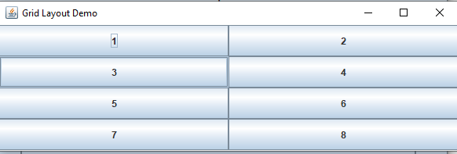
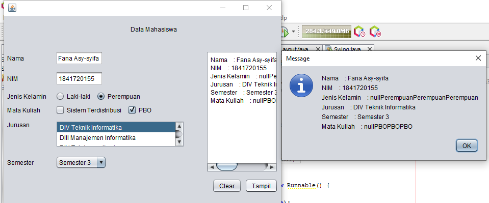
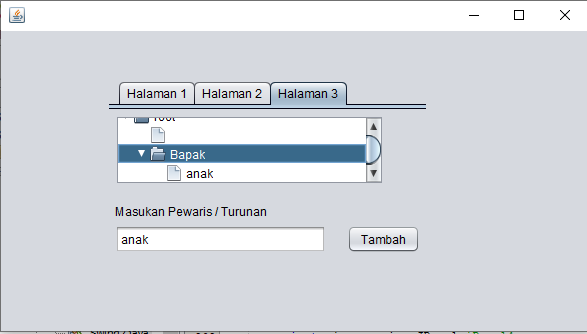

# Laporan Praktikum #11_GUI
## Kompetensi

Setelah menyelesaikan lembar kerja ini mahasiswa diharapkan mampu: 

1. Membuat aplikasi Graphical User Interface sederhana dengan bahasa pemrograman java; 
2. Mengenal komponen GUI seperti frame, label, textfield, combobox, radiobutton, checkbox, textarea, menu, serta table; 
3. Menambahkan event handling pada aplikasi GUI. 

## Ringkasan Materi

### Pendahuluan

#### GUI

Pada bab-bab sebelumnya interaksi antara user dengan program hanya berbasis console editor dengan tampilan dos yang membosankan, maka agar interaksi antara user dengan program tidak membosankan diperlukanlah sebuah interface yang menghubungkan antara user dengan  program dengan tampilan grafis, interface ini dinamakan dengan GUI(Graphical User Interface). 

Dalam pemrograman GUI terdapat beberapa bagian yang harus dilakukan yaitu: 

1. Membuat windows utama  
2. Menentukan komponen-komponen pendukung program  
3. Menentukan tata letak layout agar nantinya semua komponen – komponen yang sudah dipersiapkan bisa diaatur sedemikian rupa  
4. Event Handling dari sebuah aktivitas, seperti penekanan button, check box dan lain-lain 
Java Swing merupakan bagian dari JFC (Java Foundation Classes) yang menyediakan API untuk menangani hal yang berkaitan dengan GUI bagi program Java.  Kita bisa membedakan komponen Swing dengan komponen AWT, di mana pada umumnya kelas-kelas yang berada dalam komponen Swing diawali dengan huruf J, misal: JButton, JLabel, JTextField, JRadioButton. 
 
## Percobaan

### JFrame HelloGUI

Untuk membuat aplikasi Java berbasis GUI, kita butuh sebuah frame atau applet untuk media eksekusi aplikasi GUI. Pada Java sebuah frame dapat diwakili oleh sebuah kelas, yaitu JFrame. Melalui kelas JFrame kita bisa mendesain tampilan Java GUI sesuai kebutuhan. 

Beberapa method yang penting dan sering dipakai yaitu: 

a. setSize() : menentukan ukuran frame  
b. setLocation() : menentukan lokasi frame pada bagian pojok kiri atas  
c. setVisible() : menampilkan frame  
d. setDefaultCloseOperation() : menentukan operasi ketika frame ditutup  
e. setLocationRelativeTo() : menentukan lokasi frame relatif terhadap parameter komponen yang diinputkan  
f. Pack() : menentukan secara otomatis ukuran frame sesuai komponen yang dimasukkan  

#### HelloGui

a. setSize() : menentukan ukuran frame  
b. setLocation() : menentukan lokasi frame pada bagian pojok kiri atas  
c. setVisible() : menampilkan frame  
d. setDefaultCloseOperation() : menentukan operasi ketika frame ditutup  
e. setLocationRelativeTo() : menentukan lokasi frame relatif terhadap parameter komponen yang diinputkan  
f. Pack() : menentukan secara otomatis ukuran frame sesuai komponen yang dimasukkan 

[HelloGui1841720155Fana](../../src/11_GUI/HelloGui1841720155Fana.java)

### Percobaan 2 Menangani Input Pada GUI

#### MyInputForm 

Selanjutnya adalah bagaimana memanfaatkan komponen-komponen GUI pada Java untuk menangani inputan, dengan memanfaatkan JFrame, JButton, JLabel, JTextField, JPanel dsb 
 
1. Buatlah project baru dengan nama MyInputForm 
2. Pada kelas MyInputForm tambahkan beberapa library berikut 
3. Jadikan kelas MyInputForm sebagai turunan dari kelas JFrame 
4. Pada kelas MyInputForm tambahkan beberapa variable berikut
5. Buatlah konstruktor dengan nama MyInputForm() dan tambahkan script berikut 
6. Buatlah method createTextField() dan tambahkan script berikut untuk menampilkan Text field sebagai inputan maupun output pada window 
7. Tambahkan method createButton() untuk membuat tampilan button/tombol pada window, dan ketikkan script berikut sebagai event handling  ketika button di klik 
 8. Selanjtnya, buat method dengan nama createPanel() yang berfungsi untuk membuat panel dengan menambahkan script berikut 
 9. Langkah berikutnya, pada main program tambahkan script berikut 
 10. Compile dan Run program, maka akan tampil hasil/output perkalian nilai A dan Nilai B sebagai berikut 

#### Pertanyaan

a) Modifikasi kode program dengan menambahkan JButton baru untuk melakukan fungsi perhitungan penambahan, sehingga ketika button di klik (event click) maka akan menampilkan hasil penambahan dari nilai A dan B 

jawab :

[MyInputForm1841720155Fana](../../src/11_GUI/MyInputForm1841720155Fana.java)

### Percobaan 3 Manajemen Layout  

#### Border layout 

[Border1841720155Fana](../../src/11_GUI/Percobaan3/Border1841720155Fana.java)

#### Grid layout 

[Grid1841720155Fana](../../src/11_GUI/Percobaan3/Grid1841720155Fana.java)

#### Box layout

[Box1841720155Fana](../../src/11_GUI/Percobaan3/Box1841720155Fana.java)

#### Program main

[Layout1841720155Fana](../../src/11_GUI/Percobaan3/Layout1841720155Fana.java)

#### Pertanyaan

a. Apa perbedaan dari Grid Layout, Box Layout dan Border Layout? 

jawab :

•	Grid menampilkan angka-nya menggunakan tata letak kanan dan kiri 
•	Border menampilkan angkanya sesuai dengan table border yang telah dibuat dan telah diatur 
•	BOX menampilkan angkanya terdapat pada box nya masing masing dan menampilkan angkanya horizontal atau kebawah

b. Apakah fungsi dari masing-masing kode berikut?

jawab :

•	menampilkan setiap outputnya dari source code Border, Grid, Box

### Percobaan 4 Membuat GUI Melalui IDE Netbeans  

#### Swing

[Swing1841720155Fana](../../src/11_GUI/Swing1841720155Fana.java)

#### Pertanyaan

a) Apakah fungsi dari kode berikut?

jawab :

•	untuk menampilkan dari JFrame form
 
b) Mengapa pada bagian logika checkbox dan radio button digunakan multiple if ? 

jawab :

•	Digunakan untuk pengecekkan pada checkbox dicentang atau tidaknya

c) Lakukan modifikasi pada program untuk melakukan menambahkan inputan berupa alamat dan berikan fungsi pemeriksaan pada nilai Alamat tersebut jika belum diisi dengan menampilkan pesan peringatan 

jawab :

[Swing1841720155Fana](../../src/11_GUI/Swing1841720155Fana.java)

### Percobaan 5 JTabPane, JTtree, JTable  

#### Swing2

[Swing21841720155Fana](../../src/11_GUI/Swing21841720155Fana.java)

#### Pertanyaan

a) Apa kegunaan komponen swing JTabPane, JTtree, pada percobaan 5? 

jawab :

•	JTabPane : digunakan untuk tampilan atau background nya untuk mengisi pada 
•	setiap halaman, 
•	JTree digunakan untuk menyimpan pada tambah jika button tambahnya digunakan

b) Modifikasi program untuk menambahkan komponen JTable pada tab Halaman 1 dan tab Halaman 2

jawab :

[Swing21841720155Fana](../../src/11_GUI/Swing21841720155Fana.java)

### Assigment 

[Kalkulator1841720155Fana](../../src/11_GUI/tugas/Kalkulator1841720155Fana.java)

## Kesimpulan

Pada bab-bab sebelumnya interaksi antara user dengan program hanya berbasis console editor dengan tampilan dos yang membosankan, maka agar interaksi antara user dengan program tidak membosankan diperlukanlah sebuah interface yang menghubungkan antara user dengan program dengan tampilan grafis, interface ini dinamakan dengan GUI(Graphical User Interface). Dalam pemrograman GUI terdapat beberapa bagian yang harus dilakukan yaitu: 

1.	Membuat windows utama 
2.	Menentukan komponen-komponen pendukung program 
3.	Menentukan tata letak layout agar nantinya semua komponen – komponen yang sudah dipersiapkan bisa diaatur sedemikian rupa 
4.	Event Handling dari sebuah aktivitas, seperti penekanan button, check box dan lain-lain
 
Java Swing merupakan bagian dari JFC (Java Foundation Classes) yang menyediakan API untuk menangani hal yang berkaitan dengan GUI bagi program Java. Kita bisa membedakan komponen Swing dengan komponen AWT, di mana pada umumnya kelaskelas yang berada dalam komponen Swing diawali dengan huruf J, misal: JButton, JLabel, JTextField, JRadioButton. Tips: tuliskan kesimpulan dari hasil tugas praktikum yang telah dilakukan.

## Pernyataan Diri

Saya menyatakan isi tugas, kode program, dan laporan praktikum ini dibuat oleh saya sendiri. Saya tidak melakukan plagiasi, kecurangan, menyalin/menggandakan milik orang lain.

Jika saya melakukan plagiasi, kecurangan, atau melanggar hak kekayaan intelektual, saya siap untuk mendapat sanksi atau hukuman sesuai peraturan perundang-undangan yang berlaku.

Ttd,

***(Fana Asy-syifa)***

