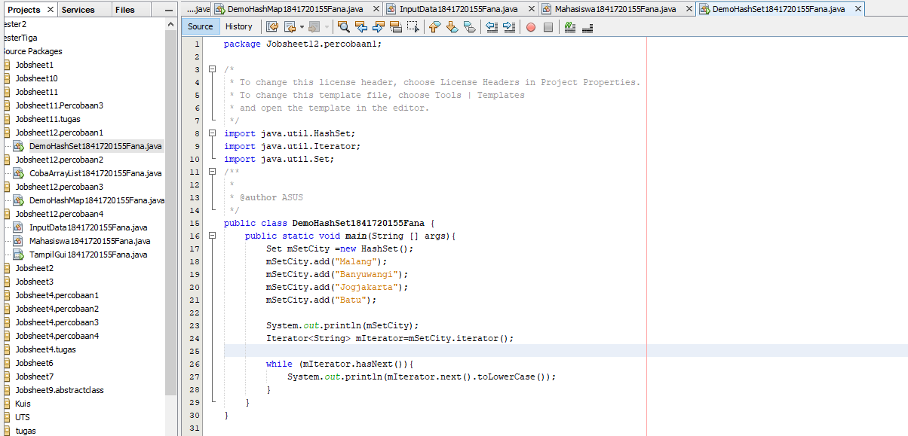

# Laporan Praktikum # 12 - Collection (List, Set, Map) dan Database  

## Kompetensi

1. Memahami cara penyimpanan objek menggunakan Collection dan Map. 
2. Mengetahui pengelompokan dari Collection. 
3. Mengetahui perbedaan dari interface Set, List dan Map. 
4. Mengetahui penggunaan class-class dari interface Set, List, dan Map. 
5. Memahami koneksi database menggunakan JDBC dan JDBC API

## Ringkasan Materi

Collection adalah suatu objek yang bisa digunakan untuk menyimpan sekumpulan objek. Objek yang ada dalam Collection disebut elemen. Collection menyimpan elemen yang bertipe Object, sehingga berbagai tipe object bisa disimpan dalam Collection. Class-class mengenai Collection tergabung dalam Java Collection Framework. Class-class Collection diletakkan dalam package java.util dan mempunyai dua interface utama yaitu Collection. 

 Collection terbagi menjadi 3 kelompok yaitu : 
 1. set

 Set mengikuti model himpunan, dimana objek/anggota yang tersimpan dalam Set harus unik. Urutan maupun letak dari anggota tidak penting, hanya keberadaan anggota saja yang penting. Kelas konkrit yang mengimplementasikan Set harus memastikan bahwa tidak terdapat elemen duplikat yang dapat ditambahkan ke dalam set. Yaitu, tidak terdapat dua elemen e1 dan e2 yang berada di dalam set yang membuat e1.equals(e2) bernilai true. ClassClass yang mengimplementasikan interface Set adalah HashSet.

HashSet dapat digunakan untuk menyimpan elemen-elemen bebas-duplikat. Kelas HashSet merupakan suatu kelas konkrit yang mengimplementasikan Set. Pembuatan objek HashSet adalah sebagai berikut: 

Set <nama_objek_HashSet> = new HashSet(); 

 2. list

List digunakan untuk menyimpan sekumpulan objek berdasarkan urutan masuk (ordered) dan menerima duplikat. Cara penyimpanannya seperti array, oleh sebab itu memiliki posisi awal dan posisi akhir, menyisipkan objek pada posisi tertentu, mengakses dan menghapus isi list, dimana semua proses ini selalu didasarkan pada urutannya. Class-class yang mengimplementasikan interface List adalah Vector, Stack, Linked List dan Array List. Pada jobsheet ini yang akan dibahas adalah ArrayList.  

ArrayList digunakan untuk membuat array yang ukurannya dinamis. Berbeda dengan array biasa yang ukurannya harus ditentukan di awal deklarasi array, dengan ArrayList, ukurannya akan fleksibel tergantung banyaknya elemen yang dimasukkan. Pendeklarasian object ArrayList sebaiknya diikuti dengan nama class yang akan dimasukkan dalam List tersebut. 

Tujuannya agar method dan property dari setiap object dalam ArrayList dapat diakses secara langsung. Pembuatan objek ArrayList adalah sebagai berikut: 

ArrayList <nama_objek_arraylist>=new ArrayList();

 3. map
 
Perbedaaan mendasar map dengan collection yang lain, untuk menyimpan objek pada Map, perlu sepasang objek, yaitu key yang bersifat unik dan nilai yang disimpan. Untuk mengakses nilai tersebut maka kita perlu mengetahui key dari nilai tersebut. Map juga dikenal sebagai dictionary/kamus. Pada saat menggunakan kamus, perlu suatu kata yang digunakan untuk pencarian. Class-class yang mengimplementasikan Map adalah Hashtable,HashMap, LinkedHashMap. Pada jobsheet ini yang akan dibahas adalah HashMap. 

HashMap adalah class implementasi dar Map, Map itu sendiri adalah interface yang memiliki fungsi untuk memetakan nilai dengan key unik. HashMap berfungsi sebagai memory record management, dimana setiap record dapat disimpan dalam sebuah Map. kemudian setiap Map diletakkan pada vektor, list atau set yang masih turunan dari collection. Pembuatan objek HashMap adalah sebagai berikut: 

HashMap <nama_objek_HashMap> = new HashMap(); 

# Percobaan

## Percobaan 1 (Set)

link kode program : 
[DemoHashSet1841720155Fana](../../src/12_Java_API/DemoHashSet1841720155Fana.java)

### Pertanyaan Percobaan 1 

1. Apakah fungsi import java.util.*; pada program diatas!
> Jawab :
Untuk mengimpor semua kelas di dalam java.

2. Pada baris program keberapakah yang berfungsi untuk menciptakan object HashSet?
> Jawab :
Pada baris ke-16.

3. Apakah fungsi potongan program dibawah ini pada percobaan 1!
> Jawab :
Untuk menambahkan objek kedalam HashSet()

4. Tambahkan set.add(“Malang”); kemudian jalankan program! Amati hasilnya dan
jelaskan mengapa terjadi error!
> Jawab :
Karena nama objek yang seharusnya adalah mSetCity. Jika mengunakan set maka
program tidak mengenali objek tersebut.

5. Jelaskan fungsi potongan program dibawah ini pada percobaan 1!
> Jawab :
Iterator digunakan untuk mengakses dan menampilkan nilai beserta tambahan ethod lalin
yang didefinisikan di dalam interface Iterator.

## Percobaan 2 (List) 

link kode program : 
[CobaArrayList1841720155Fana](../../src/12_Java_API/CobaArrayList1841720155Fana.java)

### Pertanyaan Percobaan 2

1. Apakah fungsi potongan program dibawah ini!
> Jawab :
Untuk menampilkan nilai dari mListCountry dan menampilkan data mListCountry index
ke 0 dan index ke 2.

2. Ganti potongan program pada soal no 1 menjadi sebagai berikut!
Kemudian jalankan program tersebut!
> Jawab :

3. Jelaskan perbedaan menampilkan data pada ArrayList menggunakan potongan program
pada soal no 1 dan no 2!
> Jawab :
Ketika menggunakan potongan program no 1 maka menampilkan data menggunakan list,
sedangkan pada potongan program no 2 menampilkan semua data dengan iterator.

## Percobaan 3 (Map)

link kode program : 
[DemoHashMap1841720155Fana](../../src/12_Java_API/DemoHashMap1841720155Fana.java)

### Pertanyaan percobaan 3

1. Jelaskan fungsi hMapItem.put("1","Biskuit") pada program!
> Jawab :
Untuk menambahkan object dengan key 1 dengan nama biscuit ke dalam object
hMapItem pada HashMap().
2. Jelaskan fungsi hMapItem.size() pada program!
> Jawab :
Untuk menampilkan size atau banyak data dari hMapItem.
3. Jelaskan fungsi hMapItem.remove("1") pada program!
> Jawab :
Untuk menghapus item dengan key 1.
4. Jelaskan fungsi hMapItem.clear() pada program!
> Jawab :
Untuk menghapus semua data yang ada pada hMapItem.
5. Tambahkan kode program yang di blok pada program yang sudah anda buat!
> Jawab :

6. Jalankan program dan amati apa yang terjadi!
> Jawab :

## Percobaan 4 (Implementasi ArrayList dalam GUI)

link kode program : 
[Mahasiswa1841720155Fana](../../src/12_Java_API/Mahasiswa1841720155Fana.java)

link kode program : 
[InputData1841720155Fana](../../src/12_Java_API/InputData1841720155Fana.java)

link kode program : 
[TampilGui1841720155Fana](../../src/12_Java_API/TampilGui1841720155Fana.java)

## Percobaan 5 (Aplikasi Biodata) 

eror pak, belum selesai

## Kesimpulan

Pada dalam pratikum ini kita dapat  Memahami cara penyimpanan objek menggunakan Collection dan Map. Mengetahui pengelompokan dari Collection. Mengetahui perbedaan dari interface Set, List dan Map. Mengetahui penggunaan class-class dari interface Set, List, dan Map. dan Memahami koneksi database menggunakan JDBC dan JDBC API.

## Pernyataan Diri

Saya menyatakan isi tugas, kode program, dan laporan praktikum ini dibuat oleh saya sendiri. Saya tidak melakukan plagiasi, kecurangan, menyalin/menggandakan milik orang lain.

Jika saya melakukan plagiasi, kecurangan, atau melanggar hak kekayaan intelektual, saya siap untuk mendapat sanksi atau hukuman sesuai peraturan perundang-undangan yang berlaku.

Ttd,

***(Fana Asy-syifa)***