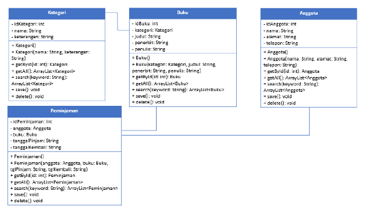
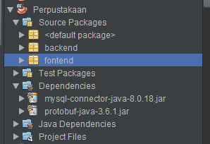
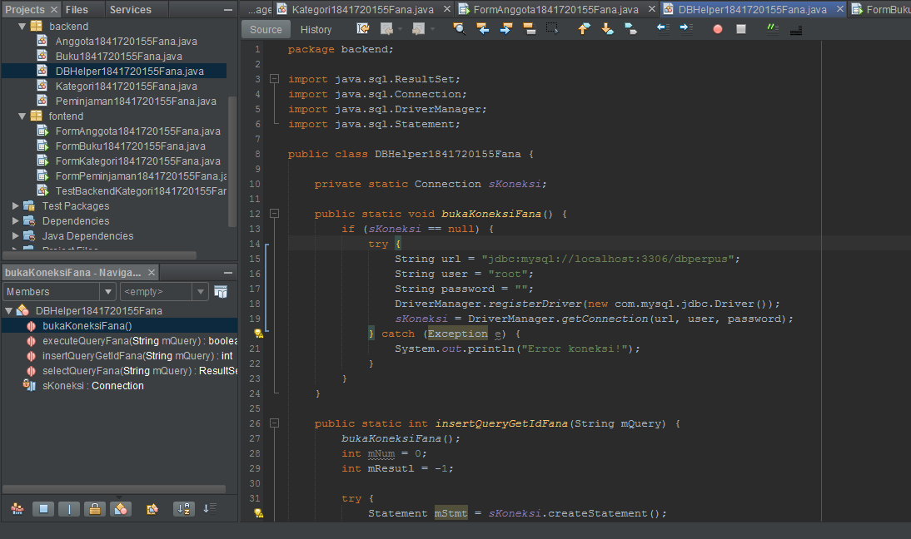
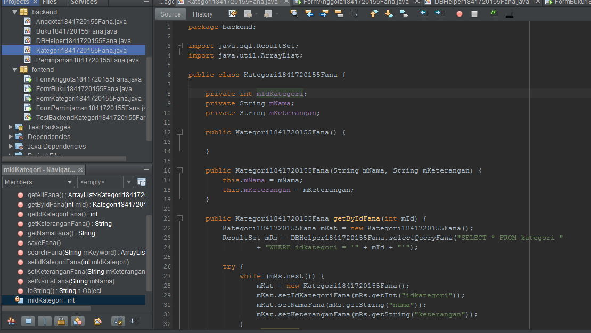
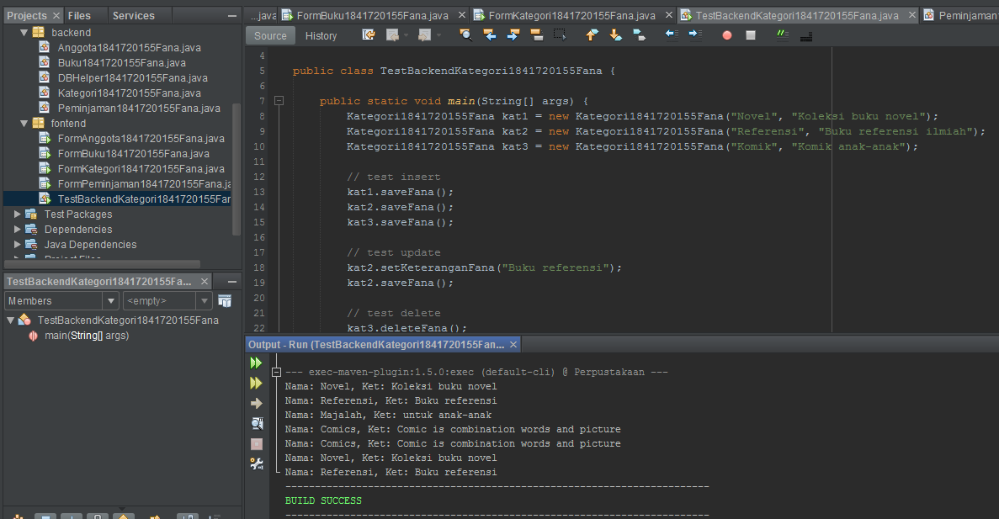
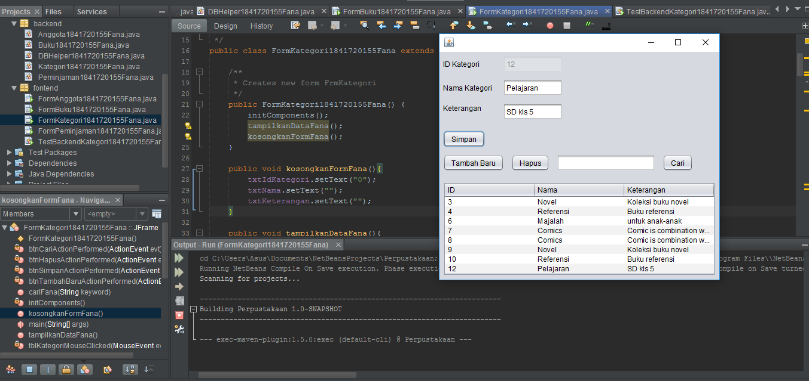
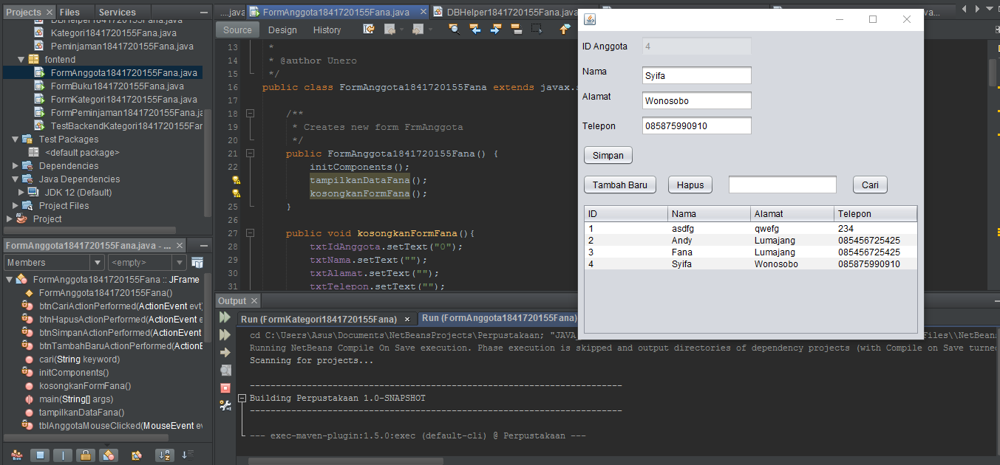
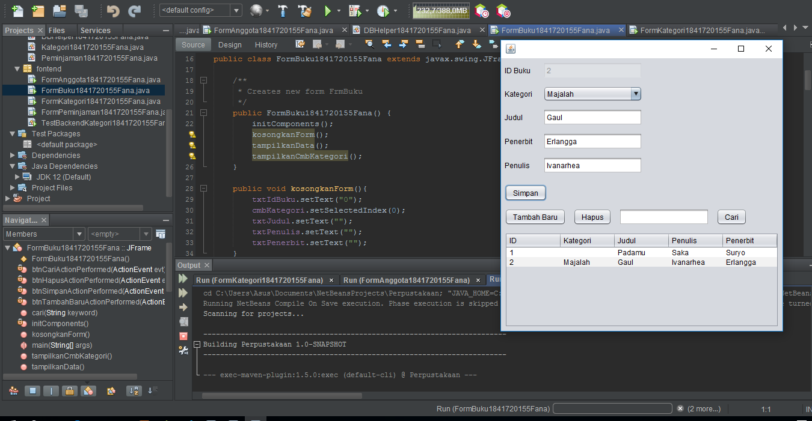
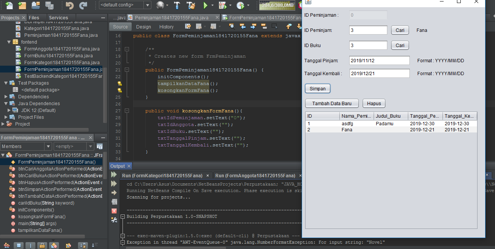

# Laporan Praktikum #14 - GUI dan Database

## Kompetensi

Setelah menempuh materi percobaan ini, mahasiswa mampu mengenal:
1. Menggunakan paradigma berorientasi objek untuk interaksi dengan database
2. Membuat backend dan frontend
3. Membuat form sebagai frontend

## Ringkasan Materi

Pada praktikum kali ini kita akan membuat sebuah GUI yang nantinya GUI ini digunakan untuk memanipulasi data yang ada di database. Misalnya untuk input data, update data, dan delete data. 

Sama seperti percobaan database pada praktikum sebelumnya nantinya kita akan menggunakan beberapa library, library yang digunakan yakni :
1. JDBC, untuk melakukan interaksi ke database.
2. ArrayList, untuk menampung data hasil query ke database.
3. Swing, untuk membuat tampilan GUI.

Pada praktikum ini kita juga belajar bagaimana membuat backend dan frontend. Backend adalah class-class yang mewakili data yang ada pada database, dan class helper untuk melakukan eksekusi query database. Sedangkan frontend adalah merupakan antarmuka kepada pengguna. Frontend ini bisa berbasis teks (console), GUI, web, mobile, dan sebagainya.

Untuk langkah-langkahnya sesuasi dengan nomor percobaan di bawah ini, setiap percobaan nantinya akan saling berhubungan.

Class diagram yang nantinya digunakan untuk praktikum kali ini adalah seperti gambar di bawah ini.

Pada praktikum ini kita mengikuti class diagram di atas.

## Percobaan

### Percobaan 1

Pada percobaan 1 kita akan membuat database dengan nama **dbperpus**. Berikut ini adalah screenshot tabel yang ada di dalam database **dbperpus**.

Tabel dalam database tersebut saling terhubung satu sama lain.

Berikut ini adalah file sql database dbperpus. 
 [dbperpus.sql](../../src/14_GUI_dan_Database/dbperpus.sql)

### Percobaan 2

Setelah percobaan 1 selesai, selanjutnya adalah percobaan 2. Pada percobaan 2 ini kita akan membuat sebuah project dengan nama Perpus1841720155Fana dan membuat 2 buah package dengan nama backend dan frontend.

Berikut ini adalah screenshot dari langkah-langkah pada percobaan 2

### Percobaan 3

Pada percobaan 3 kita akan membuat sebuah class dengan nama DBHelper1841720155Fana di dalam package backend. Class ini digunakan sebagai class yang berfungsi untuk mengeksekusi kode sql dan sebagai koneksi antara project java ini dengan mysql.

Berikut ini adalah screenshot dari class DBHelper1841720155Fana

Untuk lebih jelasnya silahkan klik link di bawah ini untuk melihat kode program pada percobaan 3.

Berikut ini adalah link file kode program pada percobaan 3 : 
 [DBHelper1841720155Fana.java](../../src/14_GUI_dan_Database/DBHelper1841720155Fana.java)

### Percobaan 4

Pada percobaan 4 kita akan membuat class Kategori1841720155Fana di dalam class backend. Class ini berfungsi sebagai CRUD database yang nantinya dapat digunakan(dipanggil) di class GUI kategori.

Berikut ini adalah screenshot dari class Kategori1841720155Fana:

Untuk lebih jelasnya silahkan klik link di bawah ini untuk melihat kode program pada percobaan 4.

Berikut ini adalah link file kode program pada percobaan 4 : 
 [Kategori1841720155Fana](../../src/14_GUI_dan_Database/Kategori1841720155Fana.java)

### Percobaan 5

Pada percobaan 5 kita akan membuat class TestBackendKategori1841720155Fana di dalam class frontend. Class ini berfungsi sebagai class yang melakukan test fungsi-fungsi yang sudah kita buat pada class Kategori1841720155Fana apakah sudah berjalan dengan baik atau belum.

Berikut ini adalah screenshot hasil dari class TestBackendKategori1841720155Fana

Untuk lebih jelasnya silahkan klik link di bawah ini untuk melihat kode program pada percobaan 5.

Berikut ini adalah link file kode program pada percobaan 5 : 
 [TestBackendKategori1841720155Fana.java](../../src/14_GUI_dan_Database/TestBackendKategori1841720155Fana.java)

### Percobaan 6

Pada percobaan 6 kita akan membuat from untuk input data kategori dengan nama FormKategori1841720155Fana. Form ini digunakan untuk menangani CRUD data kategori menggunakan GUI. 

Berikut ini adalah screenshot dan hasil running dari form FormKategori1841720155Fana.

Fungsi button-button pada form tersebut telah kami tes dan berfungsi dengan baik.

Untuk lebih jelasnya silahkan klik link di bawah ini untuk melihat kode program pada percobaan 6.

Berikut ini adalah link file kode program pada percobaan 6 : 
 [FormKategori1841720155Fana.form](../../src/14_GUI_dan_Database/FormKategori1841720155Fana.form)
 [FormKategori1841720155Fana.java](../../src/14_GUI_dan_Database/FormKategori1841720155Fana.java)

### Percobaan 7

Pada percobaan 7, langkah-langkahnya hampir sama dengan percobaan 4 yakni membuat class Anggota1841720155Fana di dalam class backend untuk menangani CRUD data anggota. Setelah class tersebut di buat, selanjutnya adalah membuat class TestBackendAnggota1841720155Fana dalam package frontend.

Berikut ini adalah screenshot hasil dari running kode program yang ada di dalam percobaan 7.

Untuk lebih jelasnya silahkan klik link di bawah ini untuk melihat kode program pada percobaan 7.

Berikut ini adalah link file kode program pada percobaan 7 : 
 [Anggota1841720155Fana.java](../../src/14_GUI_dan_Database/Anggota1841720155Fana.java)
 [TestBackendAnggota1841720155Fana](../../src/14_GUI_dan_Database/TestBackendAnggota1841720155Fana.java)

### Percobaan 8

Pada percobaan 8, kita akan membuat form untuk menangangi CRUD data anggota dengan GUI. Form tersebut ada di dalam package frontend dengan nama form yakni FormAnggota1841720155Fana.

Berikut ini adalah screenshot hasil dari running kode program yang ada di dalam percobaan 8.

Fungsi button-button pada form tersebut telah kami tes dan berfungsi dengan baik.

Untuk lebih jelasnya silahkan klik link di bawah ini untuk melihat kode program pada percobaan 8.

Berikut ini adalah link file kode program pada percobaan 8 : 
 [FormAnggota1841720155Fana.form](../../src/14_GUI_dan_Database/FormAnggota1841720155Fana.form)
 [FormAnggota1841720155Fana.java](../../src/14_GUI_dan_Database/FormAnggota1841720155Fana.java)

### Percobaan 9

Pada percobaan 9 kita akan membuat sebuah class yang bernama Buku1841720155Fana di dalam package backend. Class ini berfungsi untuk menangai CRUD data buku. Setelah class Buku1841720155Fana telah di buat, selanjutnya dalah membuat class TestBackendBuku1841720155Fana di dalam package frontend. Class ini digunakan untuk malakukan test fungsi-fungsi yang ada di dalam class Buku1841720155Fana apakah sudah berjalan dengan baik atau tidak.

Berikut ini adalah screenshot hasil dari running kode program yang ada di dalam percobaan 9.

Tabel dalam database tersebut saling terhubung satu sama lain.

Berikut ini adalah link file kode program pada percobaan 9 : 
 [Buku1841720155Fana.java](../../src/14_GUI_dan_Database/Buku1841720155Fana.java)
 [TestBackendBuku1841720155Fana](../../src/14_GUI_dan_Database/TestBackendBuku1841720155Fana.java)

### Percobaan 10

Pada percobaan 10, kita akan membuat form untuk menangani CRUD data buku dengan GUI. Form tersebut ada di dalam package frontend dengan nama form yakni FormBuku1841720155Fana.

Berikut ini adalah screenshot hasil dari running kode program yang ada di dalam percobaan 10.

Fungsi button-button pada form tersebut telah kami tes dan berfungsi dengan baik.

Untuk lebih jelasnya silahkan klik link di bawah ini untuk melihat kode program pada percobaan 10.

Berikut ini adalah link file kode program pada percobaan 8 : 
 [FormBuku1841720155Fana.form](../../src/14_GUI_dan_Database/FormBuku1841720155Fana.form)
 [FormBuku1841720155Fana.java](../../src/14_GUI_dan_Database/FormBuku1841720155Fana.java)

## Tugas

Pada bagian tugas, tugas yang akan kita kerjakan adalah membuat form peminjaman dengan tampilan dan ketentuan yang sudah ditentukan pada jobsheet bagian tugas.

Berikut ini adalah hasil pekerjaan saya pada bagian tugas.

Mohon maaf pak, pada bagian tugas ini saya hanya bisa menampilkan ke dalam form FormPeminjaman1841720155Fana. Untuk button dan table masih belum saya beri fungsi khusus, karena saya masih agak kebingungan.

Untuk lebih jelasnya silahkan klik link di bawah ini untuk melihat kode program pada bagian tugas.

Berikut ini adalah link file kode program pada bagian tugas: 
 [FormPeminjaman1841720155Fana.from](../../src/14_GUI_dan_Database/FormPeminjaman1841720155Fana.form)
 [FormPeminjaman1841720155Fana.java](../../src/14_GUI_dan_Database/FormPeminjaman1841720155Fana.java)
 [Peminjaman1841720155Fana.java](../../src/14_GUI_dan_Database/Peminjaman1841720155Fana.java)
 [TestBeckenPeminjaman1841720155Fana.java](../../src/14_GUI_dan_Database/Peminjaman1841720155Fana.java)

## Kesimpulan

Kesimpulan yang saya dapatkan dari praktikum kali ini adalah tentang bagaimana cara membuat aplikasi berbasis database (CRUD) menggunakan GUI, bagaimana konsep dan caranya membuat backend dan frontend sebuah program sederhana.

Diharapkan setelah pertemuan ini kita bisa semakin paham bagaimana cara kerja OOP, semakin mudah ketika membuat program yang menggunakan konsep OOP dan semakin mudah ketika belajar materi selanjutnya.

## Pernyataan Diri

Saya menyatakan isi tugas, kode program, dan laporan praktikum ini dibuat oleh saya sendiri. Saya tidak melakukan plagiasi, kecurangan, menyalin/menggandakan milik orang lain.

Jika saya melakukan plagiasi, kecurangan, atau melanggar hak kekayaan intelektual, saya siap untuk mendapat sanksi atau hukuman sesuai peraturan perundang-undangan yang berlaku.

Ttd,

***(Fana Asy-syifa)***
