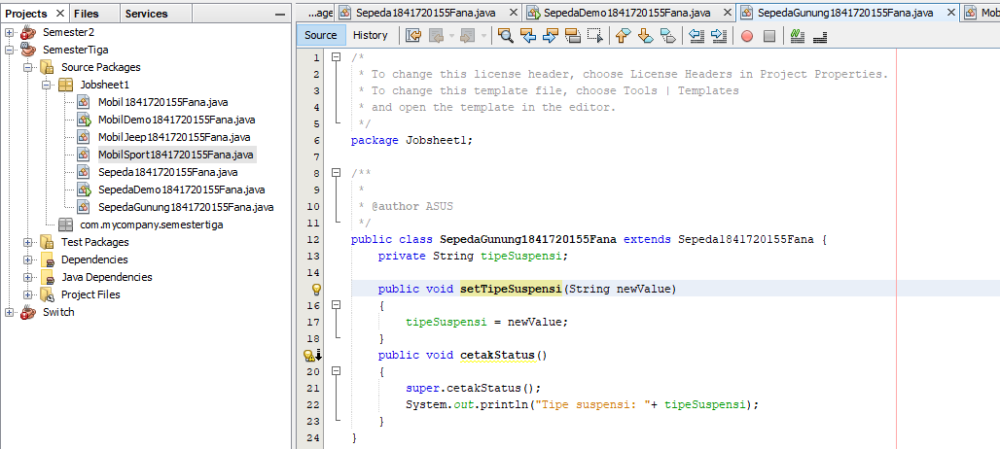
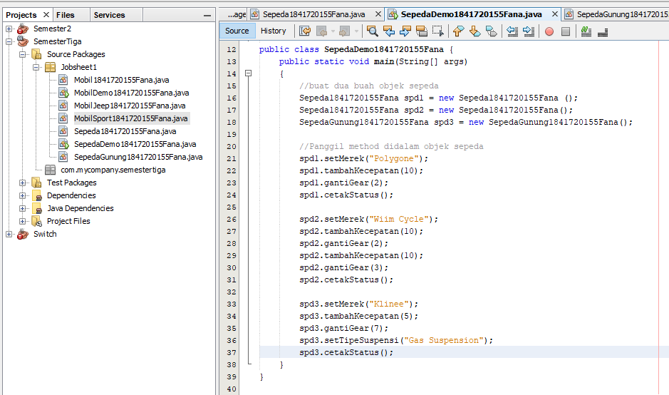
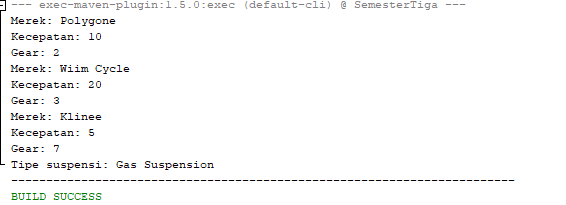

# Laporan Praktikum #1 - Pengantar Konsep PBO

## Kompetensi

Setelah menempuh materi percobaan ini, mahasiswa mampu mengenal: 
1. Perbedaan paradigma berorientasi objek dengan paradigma struktural 
2. Konsep dasar PBO 
 

## Ringkasan Materi
*Pemorgraman struktural vs berorientasi objek*

Pada pemrograman terstruktur, program dipecah kedalam sub-program atau fungsi. Sedangkan pada PBO, program dipecah kedalam objek, 
dimana objek tersebut membungkus state dan method. 
Kelebihan PBO adalah program dapat lebih fleksibel dan modular, jika ada perubahan fitur, maka dapat dipastikan keseluruhan program tidak akan terganggu. Berbeda dengan struktural, perubahan sedikit fitur saja kemungkinan dapat mengganggu keseluruhan program.  
Pada kode program objek, jelas bahwa objek baru dibuat menggunakan kata kunci new yang diikuti oleh nama kelasnya.  Menandakan bahwa sebuah object dikembalikan ke sebuah variable  dan dapat dikatakan bahwa kosep OOP lebih efisien dibandingkan pemrograman terstruktur. 

*Konsep Dasar PBO*

#### A. OBJECT
suatu rangkaian dalam program yang terdiri dari state dan behaviour.
ciri-ciri atau atribut dari objek tersebut. Misal objek Sepeda, memiliki state merek, kecepatan, gear dan sebagainya. 
Sedangkan behaviour adalah perilaku yang dapat dilakukan objek tersebut

#### B.CLASS
blueprint atau prototype dari objek. Ambil contoh objek sepeda. dari berbagai merk dan model. Namun semua sepeda dibangun 
berdasarkan blueprint yang sama, sehingga tiap sepeda memiliki komponen dan karakteristik yang sama. 
Sepeda yang anda miliki dirumah, adalah hasil instansiasi dari class sepeda. 

#### C. ENKAPSULASI
Disebut juga dengan information-hiding. Dalam berinteraksi dengan objek, seringkali kita tidak perlu mengetahui 
kompleksitas yang ada didalamnya. Contoh pada sepeda, ketika kita 
mengganti gear pada sepeda, kita tinggal menekan tuas gear yang ada di grip setang sepeda saja.
Kita tidak perlu mengetahui bagaimana cara gear berpindah secara teknis. 

#### D. INHERITANCE
Disebut juga pewarisan. Inheritance memungkinkan kita untuk mengorganisir struktur program dengan natural. 
Inheritance juga memungkinkan kita untuk memperluas fungsionalitas program tanpa harus mengubah banyak bagian program. 

#### E. POLIMORFISME
Polimorfisme juga meniru sifat objek di dunia nyata, dimana sebuah objek dapat memiliki bentuk,
atau menjelma menjadi bentuk-bentuk lain. Misalkan saja objek pesawat terbang.
Objek ini dapat diwariskan menjadi pesawat jet dan pesawat baling-baling. Keduanya memiliki kemampuan untuk menambah kecepatan.
Namun secara teknis, metode penambahan kecepatan antara pesawat jet dengan baling-baling tentu berbeda,
karena masing-masing memiliki jenis mesin yang berbeda. 

## Percobaan

### Percobaan 1

(berisi penjelasan percobaan 1. Jika ada rujukan ke file program, bisa dibuat linknya di sini.)

#### class Sepeda1841720155Fana

Contoh link kode program : [ini contoh link ke kode program](../../src/1_Pengantar_Konsep_PBO/Contoh12345Habibie.java)

#### class main SepedaDemo1841720155Fana

Contoh link kode program : [ini contoh link ke kode program](../../src/1_Pengantar_Konsep_PBO/Contoh12345Habibie.java)

### Percobaan 2

(berisi penjelasan percobaan 2. Jika ada rujukan ke file program, bisa dibuat linknya di sini.)

#### class SepedaGunung1841720155Fana

Contoh link kode program : [ini contoh link ke kode program](../../src/1_Pengantar_Konsep_PBO/Contoh12345Habibie.java)

#### class main

Contoh link kode program : [ini contoh link ke kode program](../../src/1_Pengantar_Konsep_PBO/Contoh12345Habibie.java)

## Pertanyaan

1. Sebutkan dan jelaskan aspek-aspek yang ada pada pemrograman berorientasi objek! 

jawab : 

A. OBJECT 

suatu rangkaian dalam program yang terdiri dari state dan behaviour.

B.CLASS

blueprint atau prototype dari objek.

C. ENKAPSULASI

Disebut juga dengan information-hiding. Dalam berinteraksi dengan objek, seringkali kita tidak perlu mengetahui 
kompleksitas yang ada didalamnya. 

D. INHERITANCE

Disebut juga pewarisan. Inheritance memungkinkan kita untuk mengorganisir struktur program dengan natural. 
Inheritance juga memungkinkan kita untuk memperluas fungsionalitas program tanpa harus mengubah banyak bagian program. 

E. POLIMORFISME

Polimorfisme juga meniru sifat objek di dunia nyata, dimana sebuah objek dapat memiliki bentuk,
atau menjelma menjadi bentuk-bentuk lain.

2. Apa yang dimaksud dengan object dan apa bedanya dengan class? 

jawab : 

object merupakan bentuk representasi dari sebuah kelas, membungkus data dan fungsi bersama menjadi suatu unit atau 
entitas dalam sebuah program komputer.
Sedangkan  Kelas Merupakan kumpulan atas definisi data dan fungsi-fungsi dalam suatu unit untuk suatu tujuan tertentu 
dimana didalamnya terdapat kumpulan atribut dan method

3. Sebutkan salah satu kelebihan utama dari pemrograman berorientasi objek dibandingkan dengan pemrograman struktural! 

jawab : 

Kelebihan PBO adalah program dapat lebih fleksibel dan modular, jika ada perubahan fitur, maka dapat dipastikan 
keseluruhan program tidak akan terganggu.

4. Pada class Sepeda, terdapat state/atribut apa saja?  

jawab : 

Kecepatan,gear,merek

5. Tambahkan atribut warna pada class Sepeda.

jawab :

6. Mengapa pada saat kita membuat class SepedaGunung, kita tidak perlu membuat class nya dari nol? 
 
 jawab :

karena pada class sepeda gunung terdapat Inheritance, dimana  membuat class SepedaGunung yang mana adalah 
turunan/warisan dari class Sepeda. Pada dasarnya class SepedaGunung adalah sama dengan class Sepeda, hanya 
saja pada sepeda gunung terdapat tipe suspensi. Untuk itu kita tidak perlu membuat class Sepeda Gunung dari nol, 
tapi kita wariskan saja class Sepeda ke class SepedaGunung.

## Tugas

(silakan kerjakan tugas di sini beserta `screenshot` hasil kompilasi program. Jika ada rujukan ke file program, bisa dibuat linknya di sini.)

`contoh screenshot yang benar, menampilkan 3 komponen, yaitu struktur project, kode program, dan hasil kompilasi`

Contoh link kode program : [ini contoh link ke kode program](../../src/1_Pengantar_Konsep_PBO/Contoh12345Habibie.java)

## Kesimpulan

Dari percobaan diatas, kita telah mendemonstrasikan bagaimana paradigma pemrograman berorientasi objek dan 
mengimplementasikannya kedalam program sederhana. Kita juga telah mendemonstrasikan salah satu fitur paling 
penting dari PBO yaitu inheritance, yaitu dalam hal membuat class SepedaGunung.  
Kita ketahui bahwa SepedaGunung pada dasarnya adalah sama dengan Sepeda (memiliki gear, memiliki kecepatan,
dapat menambah kecepatan, dapat mengerem, pindah gigi, dsb) namun ada fitur tambahan yaitu tipe suspensi.
Maka kita tidak perlu membuat class SepedaGunung dari nol, kita extends atau wariskan saja dari class Sepeda,
kemudian kita tinggal tambahkan fitur yang sebelumnya belum ada di class Sepeda. Inilah salah satu kelebihan 
PBO yang tidak ada di pemrograman struktural. 

## Pernyataan Diri

Saya menyatakan isi tugas, kode program, dan laporan praktikum ini dibuat oleh saya sendiri. Saya tidak melakukan plagiasi, kecurangan, menyalin/menggandakan milik orang lain.

Jika saya melakukan plagiasi, kecurangan, atau melanggar hak kekayaan intelektual, saya siap untuk mendapat sanksi atau hukuman sesuai peraturan perundang-undangan yang berlaku.

Ttd,

***(Fana Asy-syifa)***
