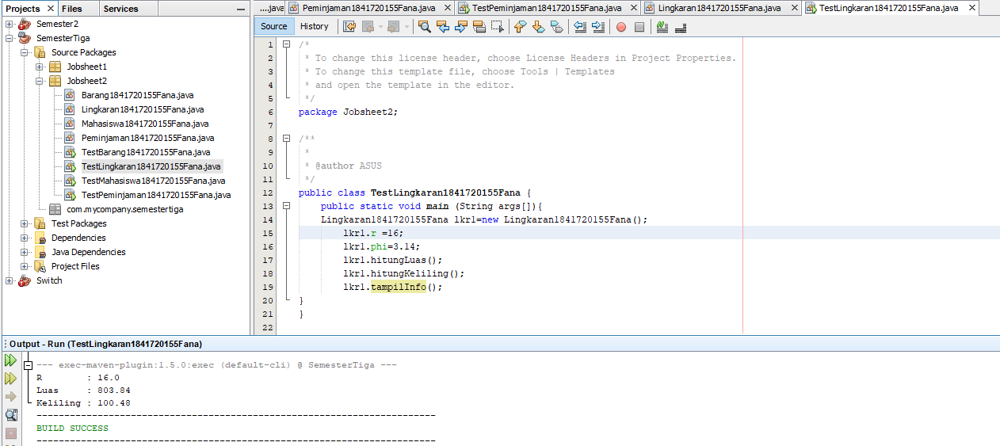

# Laporan Praktikum #2 - Class dan Objeck

## Kompetensi

 Mahasiswa dapat memahami deskripsi dari class dan object 

 Mahasiswa memahami implementasi dari class 

 Mahasiswa dapat memahami implementasi dari attribute 

 Mahasiswa dapat memahami implementasi dari method 

 Mahasiswa dapat memahami implementasi dari proses instansiasi

 Mahasiswa dapat memahami implementasi dari try-catch 

 Mahasiswa dapat memahami proses pemodelan class diagram menggunakan UML 

## Ringkasan Materi

*Class dan Object*
 Pada pertemuan sebelumnya anda sudah diberikan banyak penjelasan secara semantic (makna) mengenai deskripsi dari class dan object. Secara singkat class adalah abstraksi dari sebuah object (nyata ataupun tdk nyata) (roger s pressman). Apabila kita ingin membuat class mahasiswa, maka kita perlu melakukan abstraksi (mengindikasi bagian – bagian penting yang merepresentasikan benda itu sendiri) dari object mahasiswa itu sendiri. Contoh salah satu attribute yang mengidentifikasi jika seseorang itu mahasiswa adalah Nim (Nomor Induk Mahasiswa), dan Nim tidak akan anda temui pada attribute dosen. Selain attribute abstraksi juga digunakan untuk behavior (perilaku) , contoh salah satu perilaku yang bisa dilakukan oleh mahasiswa adalah mengikuti UAS, dan anda juga tidak akan pernah menemui perilaku tersebut pada object dosen. Oleh karena itu sangat mudah untuk seorang perancang system dalam memodelkan sebuah class dari sebuah object tertentu.  Setelah kita memahami secara semantic pengertian dari class dan object, maka langkah selanjutnya adalah bagaimana cara melakukan implementasi class pada pendekatan Object Oriented Programming, terutama pada bahasa pemrograman java. Berikut adalah sintaks dari deklarasi class pada pemrograman java : 

 

 Aturan penulisan class adalah sebagai berikut: 
 1. Berupa kata benda, 
 2. Diawali dengan HURUF BESAR, 
 3. Jika terdiri dari lebih dari 1 kata, maka antar kata satu dengan kata yang lain digandeng, dan tiap huruf awal dari tiap kata menggunakan HURUF BESAR. 

*Untuk Access Modifier tidak dibahas pada jobsheet ini, melainkan akan dibahas pada jobsheet berikutnya*

Contoh deklarasi class: 

*Attribute*
Untuk melakukan pendeklarasian attribute dapat dilakukan dengan sintaks sebagai berikut: 

Aturan penulisan atribut adalah sebagai berikut: 
1. Berupa kata benda, 
2. Diawali dengan HURUF KECIL, 
3. Jika terdiri dari 2 atau lebih kata, kata pertama diawali HURUF KECIL sedangkan kata selanjutnya diawali HURUF BESAR. Dan antar kata disambung tidak (dipisah).

Contoh deklarasi attribute: 

*Method*
Method adalah suatu blok dari program yang berisi kode program nama dan properti yang dapat digunakan kembali. Method dapat mempunyai nilai balik atau tidak. Method yang tidak mempunyai nilai balik dipanggil dalam pernyataan yang akan dikerjakan, sedangkan method yang mempunyai nilai balik dipanggil dari suatu ekpresi. Kata kunci untuk mengembalikan/mengeluarkan suatu nilai adalah return Method dengan tipe data void, berarti tidak memiliki nilai balik, berarti tidak memerlukan kata kunci return di dalamnya. Method dengan tipe data bukan void, berarti memerlukan suatu nilai balik, yaitu harus memerlukan return di dalamnya 
 
Deklarasi method dapat dilakukan dengan sintaks sebagai berikut:

Contoh method dengan tipe void dan method yang mengembalikan nilai (return)

Aturan penulisan method adalah sebagai berikut: 
1. Berupa kata kerja, 
2. Diawali dengan HURUF KECIL, 
3. Jika terdiri dari 2 atau lebih kata, kata pertama diawali HURUF KECIL sedangkan kata selanjutnya diawali HURUF BESAR. Dan antar kata disambung tidak (dipisah). 

Contoh deklarasi method: 

*Object*  
Setelah Class dibuat, langkah selanjutnya adalah membuat Object. Proses pembuatan Object dari suatu Class disebut instansiasi. Format dasar instansiasi adalah sebagai berikut: 

*Try – catch*
Untuk menangani error di Java, digunakan sebuah statement yang bernama try - catch. Statement tersebut digunakan untuk mengurung eksekusi yang menampilkan error dan dapat membuat program tetap berjalan tanpa dihentikan secara langsung. Error yang ditangani oleh try – catch biasa disebut dengan exception. 

*UML*

Unified Modeling Language ( UML ) adalah tujuan umum, perkembangan, bahasa pemodelan di bidang rekayasa perangkat lunak , yang dimaksudkan untuk menyediakan cara standar untuk memvisualisasikan desain sistem. UML menyediakan sembilan jenis diagram yaitu Diagram kelas (Class Diagram), Diagram paket (Package Diagram), Diagram use-case (Usecase Diagram), Diagram interaksi dan sequence (Sequence Diagram), Diagram komunikasi (Communication Diagram), Diagram statechart (Statechart Diagram), Diagram aktivitas (Activity Diagram), Diagram komponen (Component Diagram), dan Diagram deployment (deployment diagram). Pada materi ini yang akan dipelajari adalah diagram class (class diagram). 
 

## Percobaan

### Percobaan 1
pada percobaan ini, membuat sebuah class diagram dimana ada sebuah data karyawan dimana tiap karyawan memiliki id,nama,jenis kelamin,jabatan,dan gaji. Dan dapat menampilkan data diri pribadi dan melihat gajinya.
#### class Diagram

2. Sebutkan Class apa saja yang bisa dibuat dari studi kasus 1!

jawab :
Class Karyawan dan Class KaryawanMain

3. Sebutkan atribut beserta tipe datanya yang dapat diidentifikasi dari masing-masing class dari studi kasus 1! 

jawab :
- id : Int 
- Nama : String 
- Jenis kelamin : String
- Jabatan : String 
- Gaji  : Int

4. Sebutkan method-method yang sudah anda buat dari masing-masing class pada studi kasus 1! 

jawab :
Public void tampilDataDiri() dan  TampilGaji().

### Percobaan 2

Pada percobaan tersebut, membuat sebuah program berdasarkan class diagram , yaitu class diagram Mahasiswa

#### class Mahasiswa1841720155Fana

Contoh link kode program : [Mahasiswa1841720155Fana](../../src/2_Class_dan_Object/Mahasiswa1841720155Fana.java)

#### class main Mahasiswa1841720155Fana

Setelah membuat program class Mahasiswa, selanjutnya membuat class main, yaitu sebuah instance dari class Mahasiswa.

Contoh link kode program : [TestMahasiswa1841720155Fana](../../src/2_Class_dan_Object/TestMahasiswa1841720155Fana.java)

7. Jelaskan pada bagian mana proses pendeklarasian atribut pada program diatas!

jawab :
Pada clas mahasiswa dari  line 2 sampai dengan line 5

8. Jelaskan pada bagian mana proses pendeklarasian method pada program diatas! 

jawab :
pada class mahasiswa pada line ke 7

9. Berapa banyak objek yang di instansiasi pada program diatas! 

jawab :
satu ,  pada class  testMahasiswa

10. Apakah yang sebenarnya dilakukan pada sintaks program “mhs1.nim=101” ? 

jawab:
menampilkan pada objek

11. Apakah yang sebenarnya dilakukan pada sintaks program “mhs1.tampilBiodata()” 

jawab :
untuk  menampilkan output yang  dihasilkan

12. Instansiasi 2 objek lagi pada program diatas! 

jawab :

### Percobaan 3

Pada percobaan ini mahasiswa diharapkan membuat pemrograman dengan Class Barang dimana pada pemrograman tersebut memiliki argument/parameter dan memiliki return.

#### class Barang1841720155Fana

Contoh link kode program : [Barang1841720155Fana](../../src/2_Class_dan_Object/Barang1841720155Fana.java)

#### class Main Barang1841720155Fana

Contoh link kode program : [TestBarang1841720155Fana](../../src/2_Class_dan_Object/TestBarang1841720155Fana.java)

7. Apakah fungsi argumen dalam suatu method? 

jawab :
Fungsi  yang  memberi nilai bedasarkan suatu method

8. Ambil kesimpulan tentang kegunaan dari kata kunci return , dan kapan suatu method harus memiliki return!

jawab:
Return adalah kata kunci untuk mengembalikan atau mengelluarkan suatu nilai, method  dengan tipe data void , berarti tidaj memerlukan kata kunci return di dalamnya method dengan tipe data bukan void berarti memerlukan kata return

## Tugas

#### 1.Diagram persewaan vidio game

#### 2.class Peminjaman

Contoh link kode program : [Peminjaman1841720155Fana](../../src/2_Class_dan_Object/Peminjaman1841720155Fana.java)

##### class main Peminjaman

Contoh link kode program : [TestPeminjaman1841720155Fana](../../src/2_Class_dan_Object/TestPeminjaman1841720155Fana.java)

#### 3.class Lingkaran

Contoh link kode program : [Lingkaran1841720155Fana](../../src/2_Class_dan_Object/Lingkaran1841720155Fana.java)

##### class Main Lingkaran

Contoh link kode program : [TestLingkaran1841720155Fana](../../src/2_Class_dan_Object/TestLingkaran1841720155Fana.java)

#### 4.class Tugas Barang 

Contoh link kode program : [TugasBarang1841720155Fana](../../src/2_Class_dan_Object/TugasBarang1841720155Fana.java)

##### class Main Tugas Barang

Contoh link kode program : [TestTugasBarang1841720155Fana](../../src/2_Class_dan_Object/TestTugasBarang1841720155Fana.java)

## Kesimpulan

Jadi dari pembelajaran tersebut kita dapat memahami deskripsi class dan object, implementasi dari class tersebut, dan implementasi dari method, proses intansiasi, try-catch. kita juga dapat memahami proses pemodelan class diagram menggunakan UML.

## Pernyataan Diri

Saya menyatakan isi tugas, kode program, dan laporan praktikum ini dibuat oleh saya sendiri. Saya tidak melakukan plagiasi, kecurangan, menyalin/menggandakan milik orang lain.

Jika saya melakukan plagiasi, kecurangan, atau melanggar hak kekayaan intelektual, saya siap untuk mendapat sanksi atau hukuman sesuai peraturan perundang-undangan yang berlaku.

Ttd,

***(Fana Asy-syifa)*** 
