# Laporan Praktikum #3 - Enkapsulasi

## Kompetensi

Setelah melakukan percobaan pada modul ini, mahasiswa memahami konsep: 
1. Konstruktor 
2. Akses Modifier 
3. Atribut/method pada class 
4. Intansiasi atribut/method  
5. Setter dan getter 
6. Memahami notasi pada UML Class Diagram  

## Ringkasan Materi

## Percobaan

### Percobaan 1

pada percobaan ini yaitu Enakpsulasi, dalam percobaan ini membuat class Motor yang memiliki atribut kecepatan, dan kontakOn, dan memiliki method printStatus() untuk menampilkan satus motor.

#### class Motor1841720155Fana

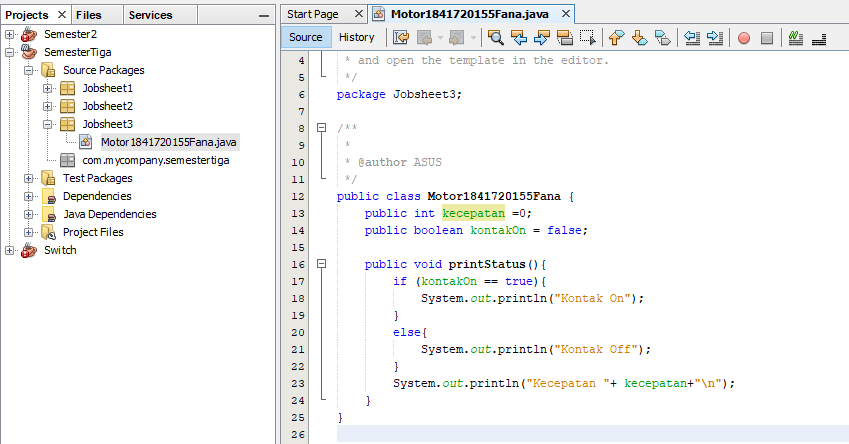

Contoh link kode program : [Motor1841720155Fana](../../src/3_Enkapsulasi/Motor1841720155Fana.java)

#### class main MotorDemo1841720155Fana

Kemudian buat class MotorDemo, ketikkan kode berikut ini. 

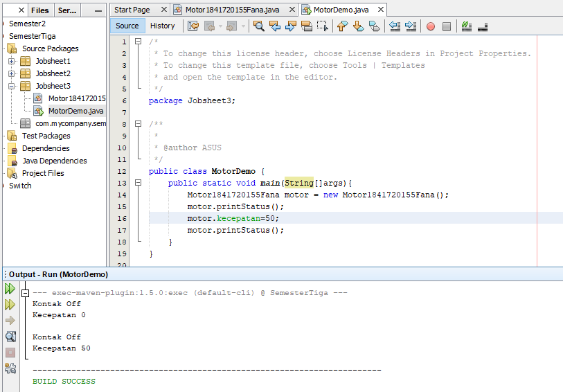

Contoh link kode program : [MotorDemo1841720155Fana](../../src/1_Enkapsulasi/MotorDemo1841720155Fana.java)

### Percobaan 2

Pada percobaan ini akan digunakan access modifier untuk memperbaiki cara kerja class Motor pada percobaan ke-1. 

#### class Motor1841720155Fana

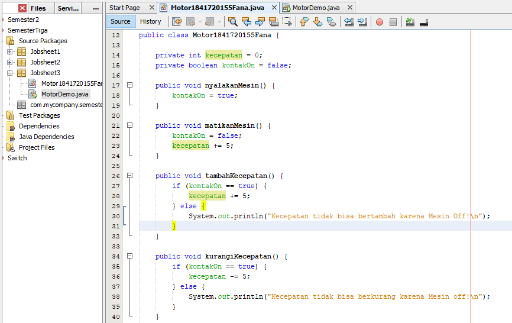

Hasil Screen Shot yang ada diatas merupakan perubahan dari class Motor sebelumnya pada percobaan 1,atau bisa dikatakan access modifier.

Contoh link kode program : [Motor1841720155Fana](../../src/3_Enkapsulasi/Motor1841720155Fana.java)

#### class main MotorDemo1841720155Fana

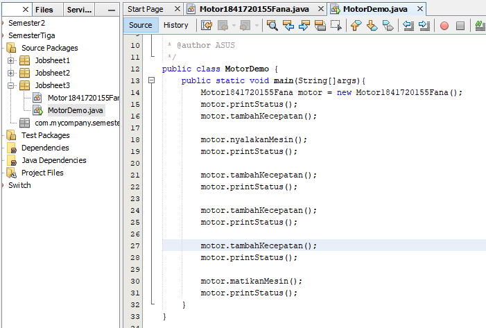

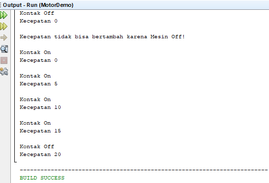

Hasil Screen Shot yang ada diatas merupakan perubahan dari class MotorDemo sebelumnya pada percobaan 1,atau bisa dikatakan access modifier.

Contoh link kode program : [MotorDemo1841720155Fana](../../src/3_Enkapsulasi/MotorDemo1841720155Fana.java)

### Percobaan 3

Pada percobaan ini akan digunakan getter and Setter. 

#### class Anggota1841720155Fana

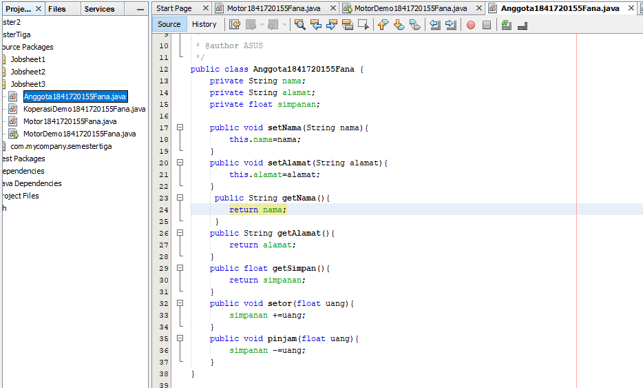

Contoh link kode program : [Anggota1841720155Fana](../../src/3_Enkapsulasi/Anggota1841720155Fana.java)

#### class main KoperasiDemo1841720155Fana

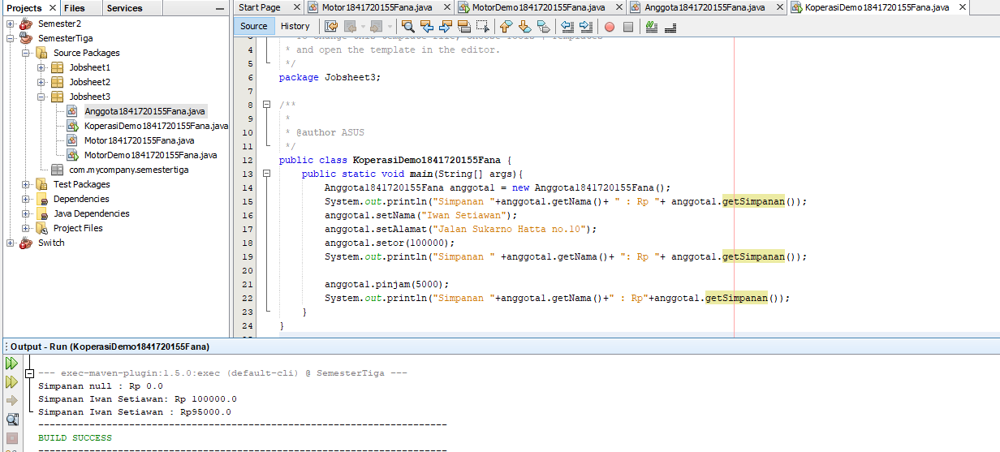

Contoh link kode program : [KoperasiDemo1841720155Fana](../../src/3_Enkapsulasi/KoperasiDemo1841720155Fana.java)

### Percobaan 4

Pada percobaan ini akan digunakan Konstruktor, Instansiasi.

#### class Main KoperasiDemo1841720155Fana

......................

Contoh link kode program : [1841720155Fana](../../src/3_Enkapsulasi/1841720155Fana.java)

...............................

#### class Anggota1841720155Fana

Perubahan dari class Anggota yang sebelumnya.

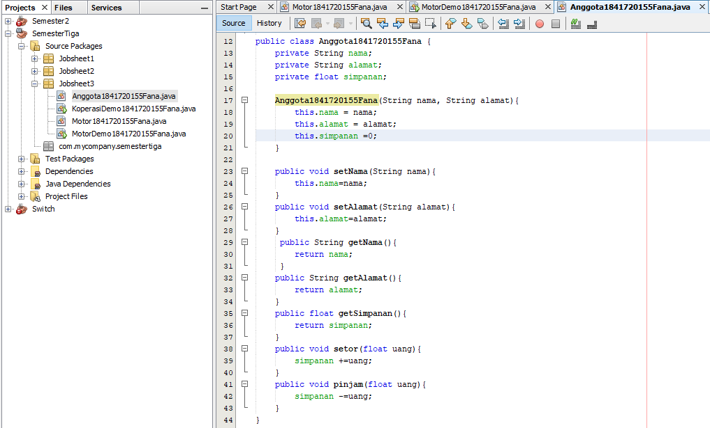

Contoh link kode program : [Anggota1841720155Fana](../../src/3_Enkapsulasi/Anggota1841720155Fana.java)

#### class KoperasiDemo1841720155Fana

perubahan class main Koperasi Demo.

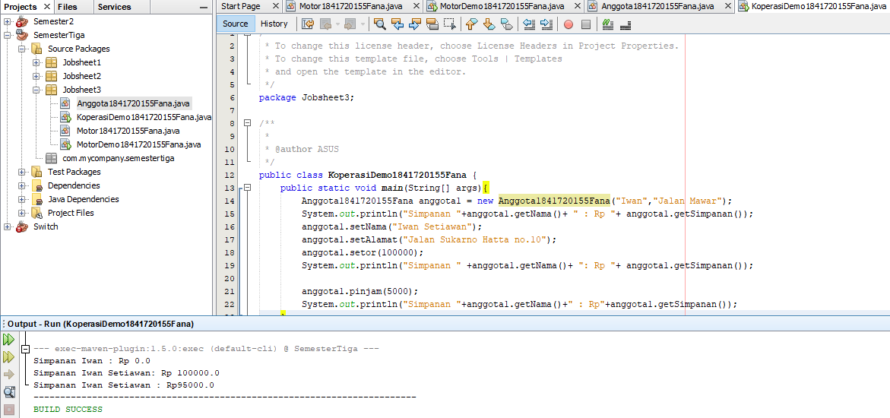

Contoh link kode program : [KoperasiDemo1841720155Fana](../../src/3_Enkapsulasi/KoperasiDemo1841720155Fana.java)

## Pertanyaan

1. Apa yang dimaksud getter dan setter? 

jawab :

2. Apa kegunaan dari method getSimpanan()? 

jawab :

3. Method apa yang digunakan untk menambah saldo? 

jawab :

4. Apa yand dimaksud konstruktor? 

jawab :

5. Sebutkan aturan dalam membuat konstruktor? 

jawab :

6. Apakah boleh konstruktor bertipe private? 

jawab:

7. Kapan menggunakan parameter dengan passsing parameter? 

jawab :

8. Apa perbedaan atribut class dan instansiasi atribut?

jawab :

9. Apa perbedaan class method dan instansiasi method? 

jawab :

 
## Tugas

(silakan kerjakan tugas di sini beserta `screenshot` hasil kompilasi program. Jika ada rujukan ke file program, bisa dibuat linknya di sini.)

### No 1

#### EncapDemo1841720155Fana

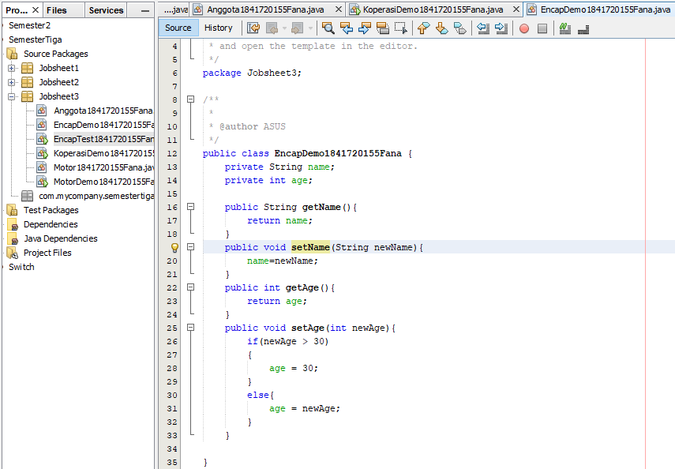

Contoh link kode program : [EncapDemo1841720155Fana](../../src/3_Enkapsulasi/EncapDemo1841720155Fana.java)

#### class Encap Test

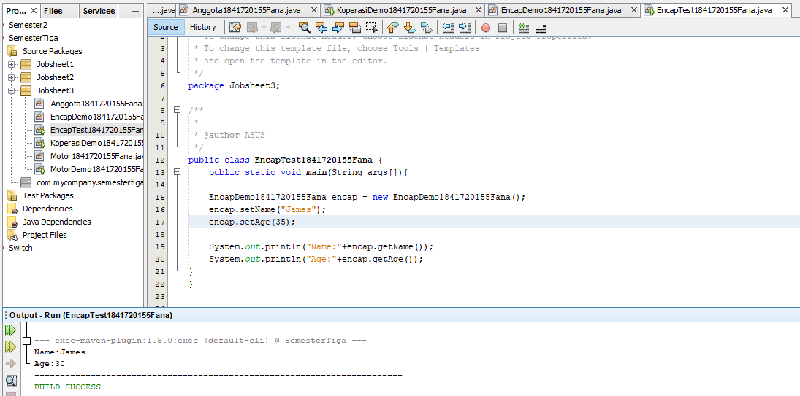

Contoh link kode program : [EncapTest1841720155Fana](../../src/3_Enkapsulasi/EncapTest1841720155Fana.java)

### No 2

## Kesimpulan

Dari percobaan diatas, telah dipelajari kosep dari enkapsulasi, kontruktor, access modifier yang terdiri dari 4 jenis yaitu public, protected, default dan private. Konsep atribut atau method class yang ada di dalam blok code class dan konsep instansiasi atribut atau method. Cara penggunaan getter dan setter beserta fungsi dari getter dan setter. Dan juga telah dipelajari atau memahami notasi UML 
 

## Pernyataan Diri

Saya menyatakan isi tugas, kode program, dan laporan praktikum ini dibuat oleh saya sendiri. Saya tidak melakukan plagiasi, kecurangan, menyalin/menggandakan milik orang lain.

Jika saya melakukan plagiasi, kecurangan, atau melanggar hak kekayaan intelektual, saya siap untuk mendapat sanksi atau hukuman sesuai peraturan perundang-undangan yang berlaku.

Ttd,

***(Fana Asy-syifa)*** 
