# Laporan Praktikum #4 - Relasi_Class

## Kompetensi

Setelah menempuh pokok bahasan ini, mahasiswa mampu: 
1. Memahami konsep relasi kelas; 
2. Mengimplementasikan relasi has‑a dalam program. 

## Ringkasan Materi

### Pendahuluan
 
 Pada kasus yang lebih kompleks, dalam suatu sistem akan ditemukan lebih dari satu class yang saling memiliki keterkaitan antara class satu dengan yang lain. Pada percobaan‑percobaan sebelumnya, mayoritas kasus yang sudah dikerjakan hanya fokus pada satu class saja. Pada jobsheet ini akan dilakukan percobaan yang melibatkan beberapa class yang saling berelasi. Misalnya terdapat class Laptop yang memiliki atribut berupa merk dan prosesor. Jika diperhatikan lebih rinci, maka atribut prosesor sendiri didalamnya memiliki data berupa merk, nilai cache memori, dan nilai clock‑nya. Artinya, ada class lain yang namanya Processor yang memiliki atribut merk, cache dan clock, dan atribut prosesor yang ada di dalam class Laptop itu merupakan objek dari class Proceessor tersebut. Sehingga terlihat antara class Laptop dan class Processor memiliki relasi (has‑a). 

 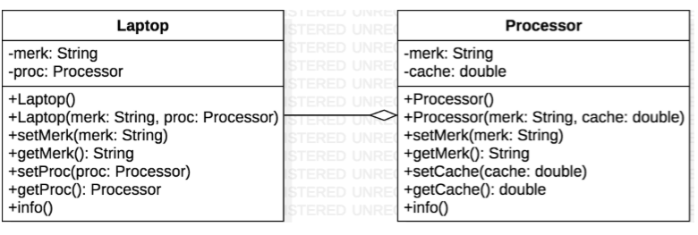

Jenis relasi has‑a ini yang akan dicontohkan pada percobaan di jobsheet ini. Apabila dilihat lebih rinci lagi, relasi tersebut disebut juga dengan agregasi (has-a). Relasi antar kelas yang lain adalah dependensi (uses-a) dan inheritance (is-a). Diperlukan inisiatif mandiri dari tiap mahasiswa untuk memperdalam jenis relasi lain terutama yang tidak dibahas pada mata kuliah ini. 

## Percobaan

### Percobaan 1

pada percobaan ini membuat package baru dan membuat class laptop,Processor, dan Mainnya

#### class Processor1841720155Fana

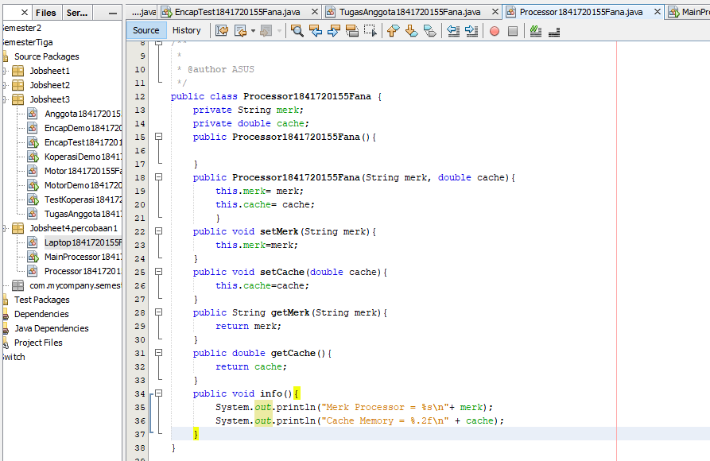

Contoh link kode program : [Processor1841720155Fana](../../src/4_Relasi_Class/Processor1841720155Fana.java)
#### class Laptop1841720155Fana

Contoh link kode program : [Laptop1841720155Fana](../../src/4_Relasi_Class/Laptop1841720155Fana.java)

#### class main Percobaan1

Kemudian buat class MotorDemo, ketikkan kode berikut ini. 

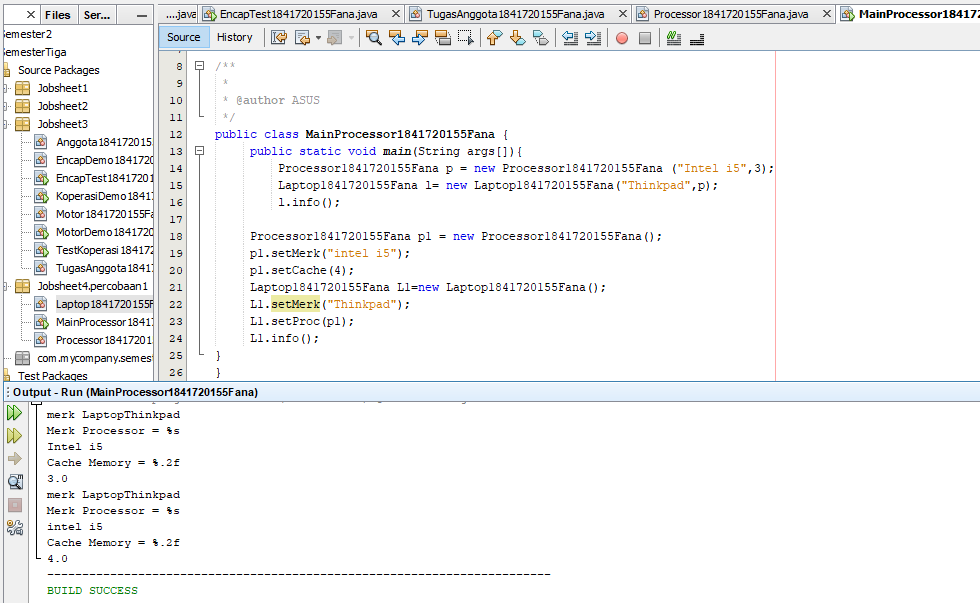

Contoh link kode program : [MainProcessor1841720155Fana](../../src/4_Relasi_Class/MainProcessor1841720155Fana.java)

### Pertanyaan
Pertanyaan Berdasarkan percobaan 
1. jawablah pertanyaan‑pertanyaan yang terkait: 1. Di dalam class Processor dan class Laptop , terdapat method setter dan getter untuk masing‑masing atributnya. Apakah gunanya method setter dan getter tersebut ?
jawab :

2. Di dalam class Processor dan class Laptop, masing‑masing terdapat konstruktor default dan konstruktor berparameter. Bagaimanakah beda penggunaan dari kedua jenis konstruktor tersebut ? 
jawab :

3. Perhatikan class Laptop, di antara 2 atribut yang dimiliki (merk dan proc), atribut manakah yang bertipe object ? 
jawab:

4. Perhatikan class Laptop, pada baris manakah yang menunjukan bahwa class Laptop memiliki relasi dengan class Processor ? 
5. Perhatikan pada class Laptop , Apakah guna dari sintaks proc.info() ?
jawab:

6. Pada class MainPercobaan1, terdapat baris kode: Laptop l = new Laptop("Thinkpad", p);. Apakah p tersebut ? 
Dan apakah yang terjadi jika baris kode tersebut diubah menjadi: Laptop l = new Laptop("Thinkpad", new Processor("Intel i5", 3)); 
Bagaimanakah hasil program saat dijalankan,apakah ada perubahan ? 
jawab :
 
 
### Percobaan 2

pada percobaan ini membuat package baru dan membuat class mobil,Sopir,Pelanggan, dan Mainnya

#### class Mobil1841720155Fana

Contoh link kode program : [Mobil1841720155Fana](../../src/4_Relasi_Class/Mobil1841720155Fana.java)

#### class Sopir1841720155Fana

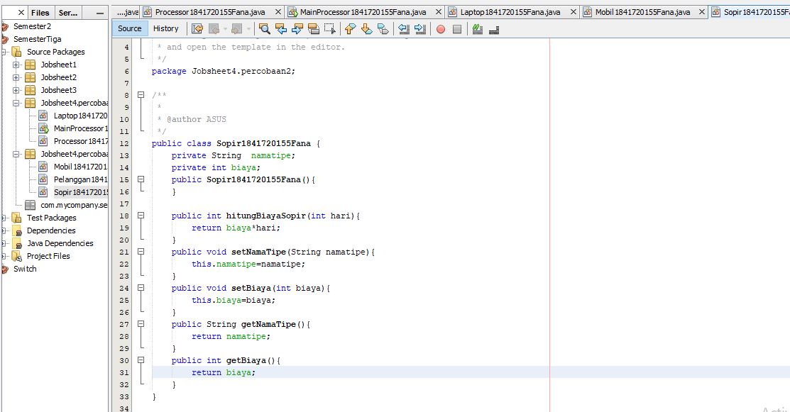

Contoh link kode program : [Sopir1841720155Fana](../../src/4_Relasi_Class/Sopir1841720155Fana.java)

#### class Pelanggan1841720155Fana

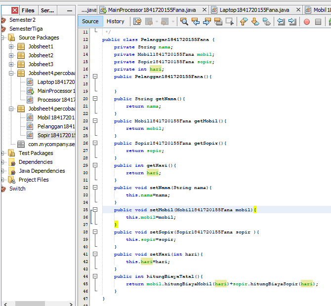

Contoh link kode program : [Pelanggan1841720155Fana](../../src/4_Relasi_Class/Pelanggan1841720155Fana.java)

#### class main MotorDemo1841720155Fana

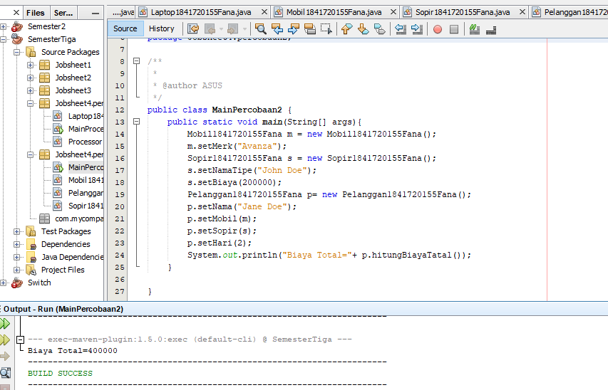

Hasil Screen Shot yang ada diatas merupakan perubahan dari class MotorDemo sebelumnya pada percobaan 1,atau bisa dikatakan access modifier.

Contoh link kode program : [MainPercobaan2](../../src/4_Relasi_Class/MainPercobaan2.java)

### Pertanyaan

1. Perhatikan class Pelanggan. Pada baris program manakah yang menunjukan bahwa class Pelanggan memiliki relasi dengan class Mobil dan class Sopir ? 
jawab :

2. Perhatikan method hitungBiayaSopir pada class Sopir, serta method hitungBiayaMobil pada class Mobil. Mengapa menurut Anda method tersebut harus memiliki argument hari ? 
Page 6 of 10 
jawab :
 
3. Perhatikan kode dari class Pelanggan. Untuk apakah perintah mobil.hitungBiayaMobil(hari) dan sopir.hitungBiayaSopir(hari) ? 
jawab :

4. Perhatikan class MainPercobaan2. Untuk apakah sintaks p.setMobil(m) dan p.setSopir(s) ?
jawab : 
5. Perhatikan class MainPercobaan2. Untuk apakah proses p.hitungBiayaTotal() tersebut ? 
jawab :
6. Perhatikan class MainPercobaan2, coba tambahkan pada baris terakhir dari method main dan amati perubahan saat di‑run! 
 
System.out.println(p.getMobil().getMerk()); 
 
Jadi untuk apakah sintaks p.getMobil().getMerk() yang ada di dalam method main tersebut? 

jawab :

### Percobaan 3

pada percobaan ini membuat package baru dan membuat class Pegawai,Kereta Api, dan Main nya.

#### class Pegawai1841720155Fana

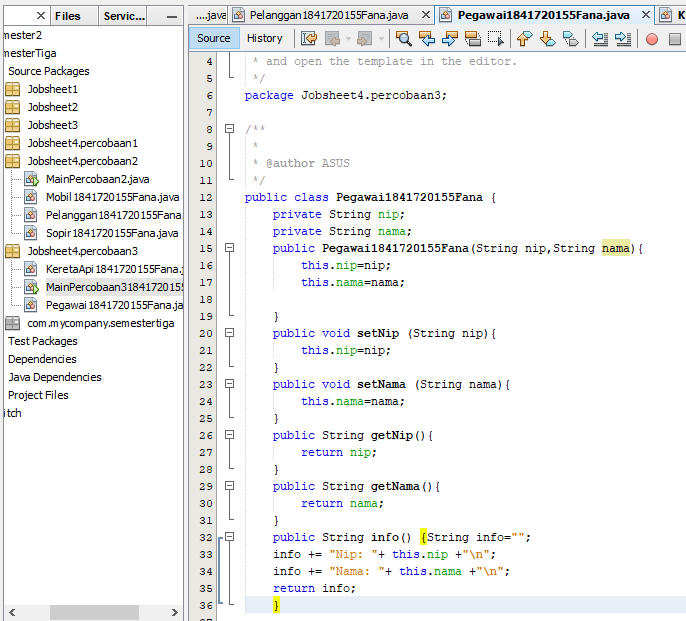

Contoh link kode program : [Pegawai1841720155Fana](../../src/4_Relasi_Class/Pegawai1841720155Fana.java)

#### class KeretaApi1841720155Fana

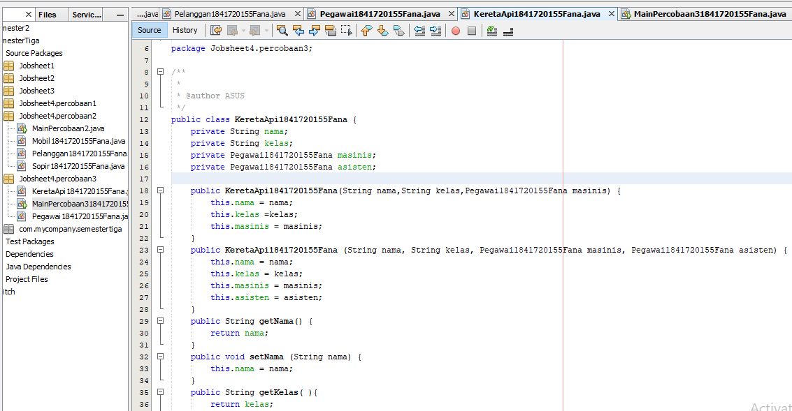
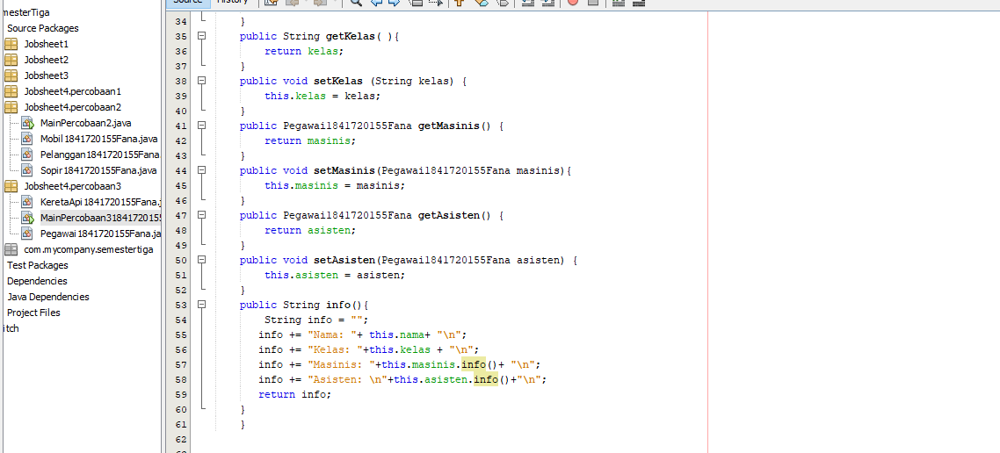

Contoh link kode program : [KeretaApi1841720155Fana](../../src/4_Relasi_Class/KeretaApi1841720155Fana.java)

#### class main Percobaan3

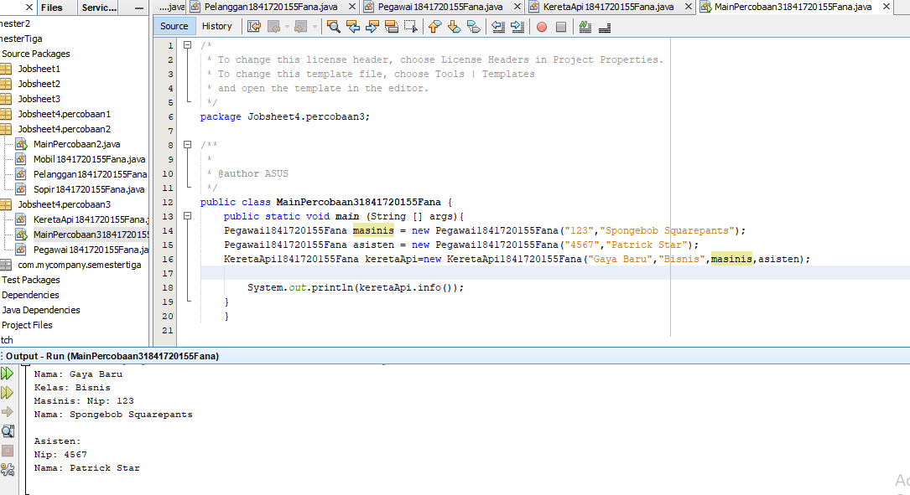

Contoh link kode program : [MainPercobaan31841720155Fana](../../src/4_Relasi_Class/MainPercobaan31841720155Fana.java)

### Pertanyaan 

1. Di dalam method info() pada class KeretaApi, baris this.masinis.info() dan this.asisten.info() digunakan untuk apa ? 
jawab:

2. Buatlah main program baru dengan nama class MainPertanyaan pada package yang sama. Tambahkan kode berikut pada method main() ! 
 
Pegawai masinis = new Pegawai("1234", "Spongebob Squarepants"); KeretaApi keretaApi = new KeretaApi("Gaya Baru", "Bisnis", masinis); 
 
System.out.println(keretaApi.info()); 

jawab :

 
3. Apa hasil output dari main program tersebut ? Mengapa hal tersebut dapat terjadi ? 4. Perbaiki class KeretaApi sehingga program dapat berjalan ! 
jawab :

### Percobaan 4

#### class Penumpang1841720155Fana

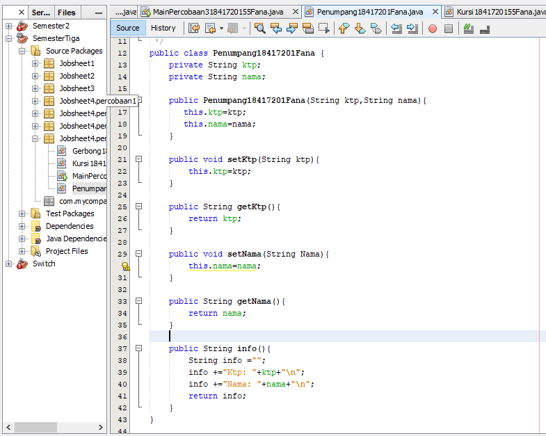

Contoh link kode program : [Penumpang1841720155Fana](../../src/4_Relasi_Class/Penumpang1841720155Fana.java)

#### class Kursi1841720155Fana

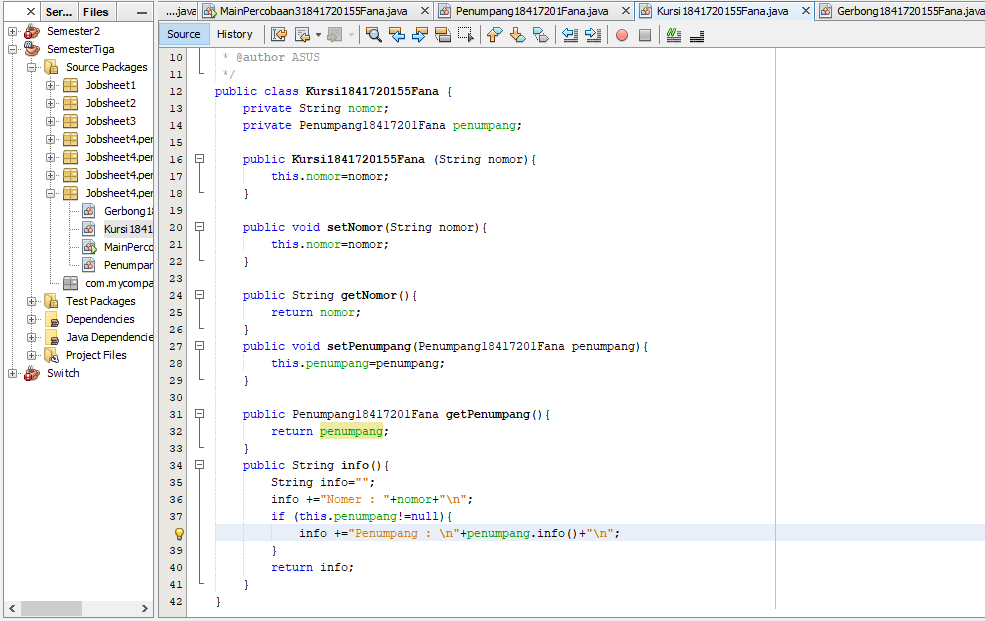

Contoh link kode program : [Kursi1841720155Fana](../../src/4_Relasi_Class/Kursi1841720155Fana.java)

#### class Gerbong1841720155Fana

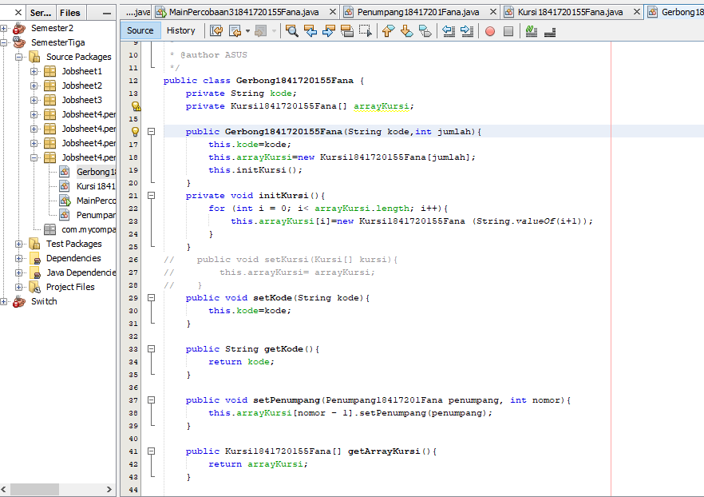

Contoh link kode program : [Gerbong1841720155Fana](../../src/4_Relasi_Class/Gerbong1841720155Fana.java)

#### class MainPercobaan41841720155Fana

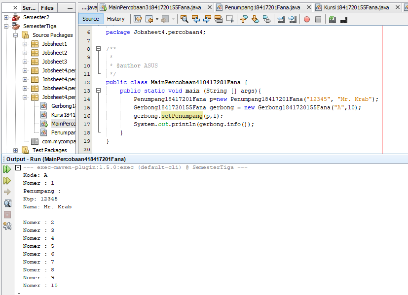

Contoh link kode program : [MainPercobaan41841720155Fana](../../src/4_Relasi_Class/MainPercobaan41841720155Fana.java)

## Pertanyaan

1. Pada main program dalam class MainPercobaan4, berapakah jumlah kursi dalam Gerbong A ? 
jawab :

2. Perhatikan potongan kode pada method info() dalam class Kursi. Apa maksud kode tersebut ? 
 
... if (this.penumpang != null) { info += "Penumpang: " + penumpang.info() + "\n"; } ... 
jawab :

 
3. Mengapa pada method setPenumpang() dalam class Gerbong, nilai nomor dikurangi dengan angka 1 ?
jawab :

4. Instansiasi objek baru budi dengan tipe Penumpang, kemudian masukkan objek baru tersebut pada gerbong dengan gerbong.setPenumpang(budi, 1). Apakah yang terjadi ? 
jawab :

5. Modifikasi program sehingga tidak diperkenankan untuk menduduki kursi yang sudah ada penumpang lain ! 
jawab :
 
 
 
## Tugas

Buatlah sebuah studi kasus, rancang dengan class diagram, kemudian implementasikan ke dalam program! Studi kasus harus mewakili relasi class dari percobaan‑percobaan yang telah dilakukan pada materi ini, setidaknya melibatkan minimal 4 class (class yang berisi main tidak dihitung).

## Kesimpulan

Dari percobaan diatas, telah dipelajari kosep dari Relasi Class. Jadi dari percobaan tersebut mahasiswa dapat memahami konsep relasi kelas dan juga mahasiswa dapat mengimplementasikan relasi has‑a dalam program. 
 

## Pernyataan Diri

Saya menyatakan isi tugas, kode program, dan laporan praktikum ini dibuat oleh saya sendiri. Saya tidak melakukan plagiasi, kecurangan, menyalin/menggandakan milik orang lain.

Jika saya melakukan plagiasi, kecurangan, atau melanggar hak kekayaan intelektual, saya siap untuk mendapat sanksi atau hukuman sesuai peraturan perundang-undangan yang berlaku.

Ttd,

***(Fana Asy-syifa)*** 
