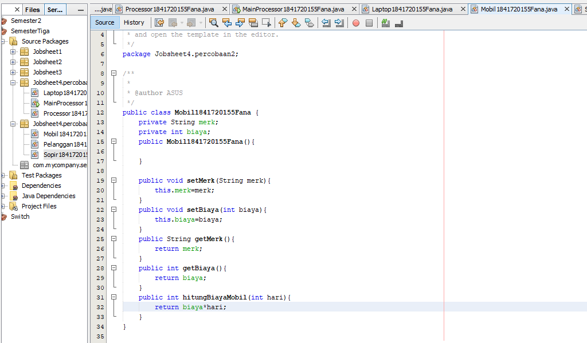
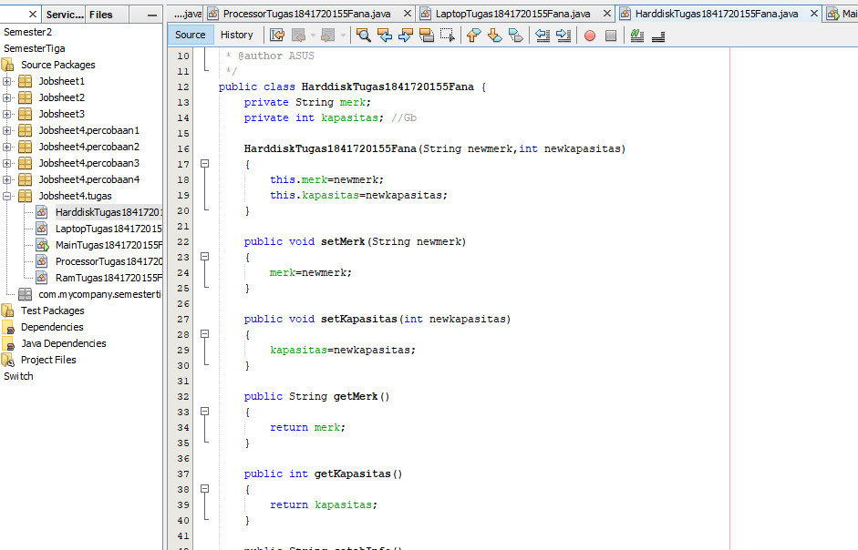
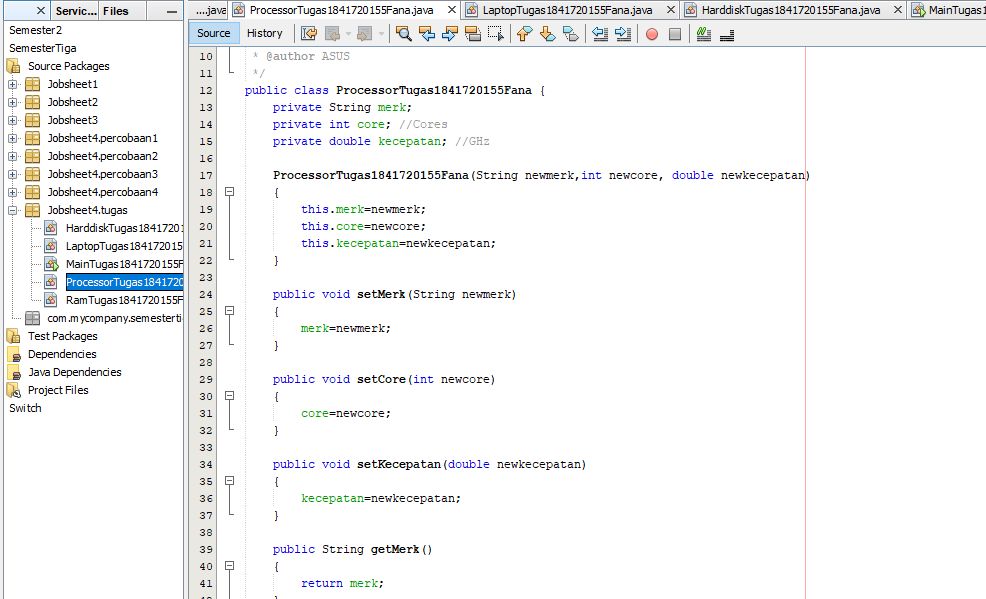
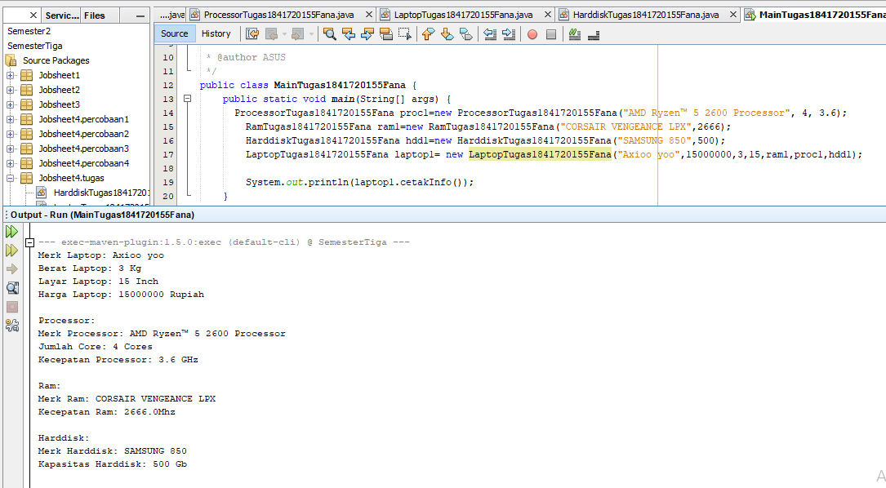

# Laporan Praktikum #4 - Relasi_Class

## Kompetensi

Setelah melakukan percobaan pada modul ini, mahasiswa memahami konsep: 
1. Konstruktor 
2. Akses Modifier 
3. Atribut/method pada class 
4. Intansiasi atribut/method  
5. Setter dan getter 
6. Memahami notasi pada UML Class Diagram  

## Ringkasan Materi

### 2.1 Enkapsulasi 
 
Pada modul pertama telah dijabarkan definisi dari enkapsulasi sebagai berikut: Enkapsukasi disebut 
juga dengan information-hiding. Dalam berinteraksi dengan objek, seringkali kita tidak perlu mengetahui 
kompleksitas yang ada didalamnya. Hal ini akan lebih mudah dipahami jika kita membayangkan atau menganalisa 
objek yang ada disekitar kita, misalnya objek sepeda, ketika kita mengganti gear pada sepeda, kita tinggal 
menekan tuas gear yang ada di grip setang sepeda saja. Kita tidak perlu mengetahui bagaimana cara gear 
berpindah secara teknis. Contoh objek lain misalnya mesin penghisap debu (vacum cleaner), ketika kita 
mencolokkan kabel vacum cleaner dan menyalakan sakelarnya maka mesin tersebut siap digunakan untuk menghisap 
debu. Dalam proses tersebut kita tidak mengetahui proses rumit yang terjadi ketika mengubah listrik menjadi 
tenaga dari vacum cleaner. Dalam contoh diatas vacum cleaner dan sepeda telah menerapkan enkapsulasi atau 
disebut juga information-hiding atau data hiding karena menyembunyikan detail proses suatu objek dari 
pengguna. 

### 2.2 konstruktor

Konstruktor mirip dengan method cara deklarasinya akan tetapi tidak memiliki tipe return. 
Dan konstruktor dieksekusi ketika instan dari objek dibuat. Jadi setiap kali sebuat objek 
dibuat dengan keyword new() maka konstruktor akan dieksekusi. Cara untuk membuat konstruktor 
adalah sebagai berikut:  
1. Nama konstruktor harus sama dengan nama class 
2. Konstruktor tidak memiliki tipe data return 
3. Konstruktor tidak boleh menggunakan modifier abstract, static, final, dan syncronized 

Note: Di java kita dapat memiliki konstruktor dengan modifier private, protected, public or default. 

### 2.3 Akses Modifier 
 
Terdapat 2 tipe modifier di java yaitu : akses modifier dan non-access modifier. Dalam hal 
ini kita akan fokus pada akses modifier yang berguna untuk mengatur akses method, class, dan 
constructor. Terdapat 4 akses modifier yaitu: 1. private – hanya dapat diakses di dalam kelas 
yang sama 2. default –  hanya dapat diakses di dalam package yang sama 3. protected – dapat 
diakases di luar package menggunakan subclass  (membuat inheritance) 4. public – dapat diakases 
dari mana saja 

### 2.4 Getter  dan Setter 
 
Getter adalah public method dan memiliki tipe data return, yang berfungsi untuk mendapatkan 
nilai dari atribut private. Sedangkan setter adalah public method yang tidak memliki tipe 
data return, yang berfungsi untuk memanipulasi nilai dari atribut private. 

### 2.5 Notasi UML Class Diagram 
 
Secara umum bentuk UML class diagram adalah seperti pada Gambar 

Keterangan : 
1. Class 
2. Interface 
3. Enumeration – adalah tipe data yang memiliki nilai atau literal yang terbatas. 
4. Atrributes 5. Method 6. Literals 

Notasi akses modifier pada UML class diagram adalah sebagai berikut: 
1. Tanda plus (+) untuk public 
2. Tanda pagar (#)  untuk protected 
3. Tanda  minus (-) untuk private 
4. Untuk default, maka tidak diberi notasi 

## Percobaan

### Percobaan 1

pada percobaan ini yaitu Enakpsulasi, dalam percobaan ini membuat class Motor yang memiliki atribut kecepatan, dan kontakOn, dan memiliki method printStatus() untuk menampilkan satus motor.

#### class Motor1841720155Fana

Contoh link kode program : [Motor1841720155Fana](../../src/3_Enkapsulasi/MotorDemo1841720155Fana.java)

#### class main MotorDemo1841720155Fana

Kemudian buat class MotorDemo, ketikkan kode berikut ini. 

Contoh link kode program : [MotorDemo1841720155Fana](../../src/3_Enkapsulasi/MotorDemo1841720155Fana.java)

### Percobaan 2

Pada percobaan ini akan digunakan access modifier untuk memperbaiki cara kerja class Motor pada percobaan ke-1. 

#### class Motor1841720155Fana

Hasil Screen Shot yang ada diatas merupakan perubahan dari class Motor sebelumnya pada percobaan 1,atau bisa dikatakan access modifier.

Contoh link kode program : [Motor1841720155Fana](../../src/3_Enkapsulasi/Motor1841720155Fana.java)

#### class main MotorDemo1841720155Fana

Hasil Screen Shot yang ada diatas merupakan perubahan dari class MotorDemo sebelumnya pada percobaan 1,atau bisa dikatakan access modifier.

Contoh link kode program : [MotorDemo1841720155Fana](../../src/3_Enkapsulasi/MotorDemo1841720155Fana.java)

### Percobaan 3

Pada percobaan ini akan digunakan getter and Setter. 

#### class Anggota1841720155Fana

Contoh link kode program : [Anggota1841720155Fana](../../src/3_Enkapsulasi/Anggota1841720155Fana.java)

#### class main KoperasiDemo1841720155Fana

Contoh link kode program : [KoperasiDemo1841720155Fana](../../src/3_Enkapsulasi/KoperasiDemo1841720155Fana.java)

### Percobaan 4

Pada percobaan ini akan digunakan Konstruktor, Instansiasi.

#### class Main KoperasiDemo1841720155Fana

Contoh link kode program : [KoperasiDemo1841720155Fana](../../src/3_Enkapsulasi/KoperasiDemo1841720155Fana.java)

#### class Anggota1841720155Fana

Perubahan dari class Anggota yang sebelumnya.

Contoh link kode program : [Anggota1841720155Fana](../../src/3_Enkapsulasi/Anggota1841720155Fana.java)

#### class KoperasiDemo1841720155Fana

perubahan class main Koperasi Demo.

Contoh link kode program : [KoperasiDemo1841720155Fana](../../src/3_Enkapsulasi/KoperasiDemo1841720155Fana.java)

## Pertanyaan

1. Apa yang dimaksud getter dan setter? 

jawab : 
Getter adalah public method dan memiliki tipe data return, yang berfungsi untuk
mendapatkan nilai dari atribut private. Sedangkan setter adalah public method yang tidak memliki tipe
data return, yang berfungsi untuk memanipulasi nilai dari atribut private.

2. Apa kegunaan dari method getSimpanan()? 

jawab : 
Merupakan method yang digunakan untuk mendapatkan nilai dari atribut simpanan yang
nantinya method tersebut digunkan untuk menampilkan nilai dari atribut simpanan

3. Method apa yang digunakan untk menambah saldo? 

jawab : method setor

4. Apa yand dimaksud konstruktor? 

jawab : 
Konstruktor mirip dengan method cara deklarasinya akan tetapi tidak memiliki tipe return.
Dan konsturktor dieksekusi ketika instan dari objek dibuat. Jadi setiap kali sebuat objek dibuat dengan
keyword new() maka konstruktor akan dieksekusi. Atau kalau dari pandangan saya konstruktor
merupakan cara untuk menambah parameter pada objek.

5. Sebutkan aturan dalam membuat konstruktor? 

jawab : 
• Nama konstruktor harus sama dengan nama class
• Konstruktor tidak memiliki tipe data return
• Konstruktor tidak boleh menggunakan modifier abstract, static, final, dan syncronized

6. Apakah boleh konstruktor bertipe private? 

jawab:  
Tidak, bila private maka objek tidak bisa diakes atau tidak bisa di instansiasi oleh class lain

7. Kapan menggunakan parameter dengan passsing parameter? 

jawab :  
Bila kita menggunakan konstruktor maka sebaiknya kita menggunakan passing parameter dan
juga sebaliknya.

8. Apa perbedaan atribut class dan instansiasi atribut?

jawab : 
Class merupakan brueprint dari prototype dari objek, kalau instansiasi dibunakan untuk
memanggil sebuah objek dari class yang lain 

9. Apa perbedaan class method dan instansiasi method? 

jawab :  
Method merupakan suatu operasi berupa fungsi-fungsi yang dapat dikerjakan oleh suatu
object.
 
## Tugas

### No 1

#### EncapDemo1841720155Fana

Contoh link kode program : [EncapDemo1841720155Fana](../../src/3_Enkapsulasi/EncapDemo1841720155Fana.java)

#### class Encap Test

Contoh link kode program : [EncapTest1841720155Fana](../../src/3_Enkapsulasi/EncapTest1841720155Fana.java)

### No 2

2. Pada program diatas, pada class EncapTest kita mengeset age dengan nilai 35, namun pada saat ditampilkan ke layar nilainya 30, jelaskan mengapa.
Jawab : 
Karena pada method setAge terdapat percabangan yang didalamnya berisi bila nilai dari
atribut age lebih dari 30 maka nilai age akan menjadi 30

### No 3

3. Ubah program diatas agar atribut age dapat diberi nilai maksimal 30 dan minimal 18. 

#### EncapDemo1841720155Fana

[EncapDemo1841720155Fana](../../src/3_Enkapsulasi/EncapDemo1841720155Fana.java)

#### class Encap Test

[EncapTest1841720155Fana](../../src/3_Enkapsulasi/EncapTest1841720155Fana.java)

### No 4

4. Pada sebuah sistem informasi koperasi simpan pinjam, terdapat class Anggota yang memiliki atribut antara lain nomor KTP, 
nama, limit peminjaman, dan jumlah pinjaman. Anggota dapat meminjam uang dengan batas limit peminjaman yang ditentukan. 
Anggota juga dapat mengangsur pinjaman. Ketika Anggota tersebut mengangsur pinjaman, maka jumlah pinjaman akan berkurang 
sesuai dengan nominal yang diangsur. Buatlah class Anggota tersebut, berikan atribut, method dan konstruktor sesuai dengan kebutuhan. 
Uji dengan TestKoperasi berikut ini untuk memeriksa apakah class Anggota yang anda buat telah sesuai dengan yang diharapkan. 

jawab :
*TugasAnggota*

 
 

 [TugasAnggota1841720155Fana](../../src/3_Enkapsulasi/TugasAnggota1841720155Fana.java)

*TestKoperasi1841720155Fana*

 [TestKoperasi1841720155Fana](../../src/3_Enkapsulasi/TestKoperasi1841720155Fana.java)

 ### No 5

5.  Modifikasi soal no. 4 agar nominal yang dapat diangsur minimal adalah 10% dari jumlah pinjaman saat ini. Jika mengangsur kurang dari itu, maka muncul peringatan “Maaf, angsuran harus 10% dari jumlah pinjaman”. 

*tugasAnggota*
menambahkan dari class tugas anggota

 [TugasAnggota1841720155Fana](../../src/3_Enkapsulasi/TugasAnggota1841720155Fana.java)

*testKoperasi*
menambahkan dari test koperasi

[TestKoperasi1841720155Fana](../../src/3_Enkapsulasi/TestKoperasi1841720155Fana.java)

 ### No 6

6. Modifikasi class TestKoperasi, agar jumlah pinjaman dan angsuran dapat menerima input dari console. 

*tugasAnggota*

[TugasAnggota1841720155Fana](../../src/3_Enkapsulasi/TugasAnggota1841720155Fana.java)

*testKoperasi*

[TestKoperasi1841720155Fana](../../src/3_Enkapsulasi/TestKoperasi1841720155Fana.java)

## Kesimpulan

Dari percobaan diatas, telah dipelajari kosep dari enkapsulasi, kontruktor, access modifier yang terdiri dari 4 jenis yaitu public, protected, default dan private. Konsep atribut atau method class yang ada di dalam blok code class dan konsep instansiasi atribut atau method. Cara penggunaan getter dan setter beserta fungsi dari getter dan setter. Dan juga telah dipelajari atau memahami notasi UML 
 

## Pernyataan Diri

Saya menyatakan isi tugas, kode program, dan laporan praktikum ini dibuat oleh saya sendiri. Saya tidak melakukan plagiasi, kecurangan, menyalin/menggandakan milik orang lain.

Jika saya melakukan plagiasi, kecurangan, atau melanggar hak kekayaan intelektual, saya siap untuk mendapat sanksi atau hukuman sesuai peraturan perundang-undangan yang berlaku.

Ttd,

***(Fana Asy-syifa)*** 
