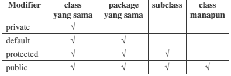

# Laporan Praktikum #6 -Inheritance

## Kompetensi

1. Memahami konsep dasar inheritance atau pewarisan.	
2. Mampu membuat suatu subclass dari suatu superclass tertentu.	
3. Mampu mengimplementasikan konsep single dan multilevel inheritance.	
4. Mampu membuat objek dari suatu subclass dan melakukan pengaksesan terhadap atribut dan method baik yang dimiliki 

## Ringkasan Materi

### Pendahuluan
 
Inheritance atau pewarisan sifat merupakan suatu cara untuk menurunkan suatu class yang lebih umum menjadi suatu class yang lebih spesifik. Inheritance adalah salah satu ciri utama suatu bahasa program yang berorientasi pada objek. Inti dari pewarisan adalah sifat reusable dari konsep object oriented. Setiap subclass akan “mewarisi” sifat dari superclass selama bersifat protected ataupun public.
Dalam inheritance terdapat dua istilah yang sering digunakan. Kelas yang menurunkan disebut kelas dasar (base class/super class), sedangkan kelas yang diturunkan disebut kelas turunan (derived class/sub class/child class) . Di dalam Java untuk mendeklarasikan suatu class sebagai subclass dilakukan dengan cara menambahkan kata kunci extends setelah deklarasi nama class, kemudian diikuti dengan nama parent class-­‐nya. Kata kunci extends tersebut memberitahu kompiler Java bahwa kita ingin melakukan perluasan class. Berikut adalah contoh deklarasi inheritance.

Contoh  diatas  memberitahukan  kompiler  Java  bahwa  kita  ingin  meng-­‐extend  class  A  ke  class  B. Dengan kata lain, class B adalah subclass (class turunan) dari class A, sedangkan class A adalah parent class dari class B.
Karakteristik pada super class akan dimiliki juga oleh subclassnya. Terdapat 3 bentuk pewarisan: single inheritance, multilevel inheritance, dan multiple inheritance. Namun yang akan dibahas pada jobsheet ini adalah single inheritance dan multilevel inheritance.

1.	Single Inheritance
Single inheritance adalah Suatu class yang hanya mempunyai satu parent class. Contoh:

Berdasarkan Gambar 1 dapat diketahui bahwa class B merupakan subclass yang mempunyai satu parent yaitu class A sehingga disebut single inheritance.

2.	Multilevel Inheritance
Multilevel inheritance adalah Suatu subclass bisa menjadi superclass bagi class yang lain. Contoh:

Berdasarkan Gambar 2 diatas dapat dilihat bahwa class B merupakan subclass dari class A, sehingga dalam hal ini class A adalah superclass dan class B adalah subclass. Kemudian class B yang awalmya merupakan subclass mempunyai subclass lagi yaitu class C sehingga class B menjadi superclass dari class C, begitu juga seterunya jika class C memilki subclass lagi.

Pada class diagram, pewarisan digambarkan dengan sebuah garis tegas, dengan segitiga di ujungnya. Class yang dekat pada segitiga merupakan superclass, sedangkan class yang jauh dari segitiga merupakan subclass. Untuk membentuk sebuah subclass, keyword “extends” digunakan (lihat contoh pada sesi “Implementasi Pewarisan”). Berikut ini adalah contoh class diagram dari pewarisan:

Suatu  parent  class  dapat  tidak  mewariskan  sebagian  member-­‐nya  kepada  subclass-­‐nya. Sejauh mana suatu member dapat diwariskan ke  class  lain,  ataupun  suatu  member  dapat  diakses  dari class lain, sangat berhubungan dengan access control (kontrol  pengaksesan).  Di  dalam  java,  kontrol pengaksesan dapat digambarkan dalam tabel berikut ini:

Kata kunci super dipakai untuk merujuk pada member dari parent class. Sebagaimana kata kunci this yang dipakai untuk merujuk pada member dari class itu sendiri. Format penulisannya adalah sebagai berikut:
•	super.namaAtribut
Merujuk/mengakses atribut dari parent class /superclass
•	super.namaMethod()
Merujuk/memanggil method dari parent class /superclass
•	super()
Merujuk / memanggil konstruktor parent class /superclass Hanya bisa digunakan dibaris pertama dalam kontruktor.
•	super(parameter1, parameter2,dst)
Merujuk / memanggil konstruktor berparamter dari superklas

Ketika mmebuat objek dari subclass, pada saat itu juga objek pada superclass juga akan terbentuk. Dengan katalain, ketika kontruktor subclass dijalankan untuk membuat objek, saat itu juga kontruktor superclass akan berjalan. Jadi di setiap konstruktor subclass, pada baris pertama konstruktor subclass tersebut akan dipanggil konstruktor superclass. Sebelum subclass menjalankan kontruktornya sendiri, subclass akan menjalankan kontruktor superclass terlebih dahulu.

## Percobaan

### Percobaan 1 (Extends)

pada percobaan ini membuat package baru dan membuat class A dan Class B

#### class A1841720155Fana

Contoh link kode program : [ClassA1841720155Fana](../../src/4_Relasi_Class/ClassA1841720155Fana.java)
#### class B1841720155Fana

Contoh link kode program : [B1841720155Fana](../../src/4_Relasi_Class/B1841720155Fana.java)

#### class main Percobaan1

Kemudian buat class MotorDemo, ketikkan kode berikut ini.

Contoh link kode program : [MainPer1Fana1841720155](../../src/4_Relasi_Class/MainPer1Fana1841720155.java)

### Pertanyaan
Pertanyaan Berdasarkan percobaan 
jawablah pertanyaan‑pertanyaan yang terkait: 

1. Pada percobaan 1 diatas program yang dijalankan terjadi error, kemudian perbaiki sehingga program tersebut bias dijalankan dan tidak error!

jawab :

 

 public class ClassB extends ClassA 

2. Jelaskan apa penyebab program pada percobaan 1 ketika dijalankan terdapat error!

jawab :

penyebabnya adalah ClassB tidak di beri “extends ClassA” sehingga terjadi error

 
### Percobaan 2

(Pada percobaan 2 kita mendemonstrasikan bagaimana melakukan hak akses )

#### class ClassA21841720155Fana

Contoh link kode program : [ClassA1Fana1841720155](../../src/4_Relasi_Class/ClassA1Fana1841720155.java)

#### class ClassB1841720155Fana

Contoh link kode program : [ClassB2Fana1841720155](../../src/4_Relasi_Class/ClassB2Fana1841720155.java)

#### class main Percobaan2

Contoh link kode program : [MainPer2Fana1841720155](../../src/4_Relasi_Class/MainPer2Fana1841720155.java)

### Pertanyaan

1. Pada percobaan 2 diatas program yang dijalankan terjadi error, kemudian perbaiki sehingga program tersebut bisa dijalankan dan tidak error!

jawab :

public int x; public int y; public int z; 

2. Jelaskan apa penyebab program pada percobaan 1 ketika dijalankan terdapat error!	

jawab :
 
karena modifier sebelumnya private sehingga variable tidak dapat diakses oleh kelas lain 

### Percobaan 3

(Pada percobaan 3 kita mendemonstrasikan bagaimana menggunakan super)

#### class BangunFana1841720155

Contoh link kode program : [BangunFana1841720155](../../src/4_Relasi_Class/BangunFana1841720155.java)

#### class Tabung1841720155Fana

Contoh link kode program : [Tabung1841720155Fana](../../src/4_Relasi_Class/Tabung1841720155Fana.java)

#### class main Percobaan3

Contoh link kode program : [MainPer3Fana1841720155](../../src/4_Relasi_Class/MainPercobaan3Fana1841720155.java)

### Pertanyaan 

1. Jelaskan fungsi “super” pada potongan program berikut di class Tabung!

jawab:

Super digunakan untuk merepresenta-sikan objek dari class induk. 

2. Jelaskan fungsi “super” dan “this” pada potongan program berikut di class Tabung! 

jawab :

karena phi dan r berasal dari class induk maka harus direpresentasikan dengan super. 

karena t berasal dari kelas yang sama maka direpresentasikan dengan this. 
 
3. Jelaskan mengapa pada class Tabung tidak dideklarasikan atribut “phi” dan “r” tetapi class tersebut dapat mengakses atribut tersebut.

jawab :

karena ditambahkan “extends Bangun” pada class Tabung

### Percobaan 4

(Pada percobaan 4 kita mendemonstrasikan bagaimana menggunakan super konstruktor)

#### class A4

Contoh link kode program : [Penumpang1841720155Fana](../../src/4_Relasi_Class/Penumpang1841720155Fana.java)

#### class B4

Contoh link kode program : [Kursi1841720155Fana](../../src/4_Relasi_Class/Kursi1841720155Fana.java)

#### class C4

Contoh link kode program : [Gerbong1841720155Fana](../../src/4_Relasi_Class/Gerbong1841720155Fana.java)

#### class Main Percobaan4

Contoh link kode program : [MainPercobaan41841720155Fana](../../src/4_Relasi_Class/MainPercobaan41841720155Fana.java)

## Pertanyaan

1. Pada percobaan 4 sebutkan mana class yang termasuk superclass dan subclass, kemudian jelaskan alasannya!

jawab :

2. Ubahlah isi konstruktor default ClassC seperti berikut:	 Tambahkan kata super() di baris	 Pertaman dalam konstruktor defaultnya. Coba jalankan kembali class Percobaan4 dan terlihat tidak ada perbedaan dari hasil outputnya!	

jawab :

 
3. Ublah isi konstruktor default ClassC seperti berikut:
Ketika mengubah posisi super() dibaris kedua dalam kontruktor defaultnya dan terlihat ada error. Kemudian kembalikan super() kebaris pertama seperti sebelumnya, maka errornya akan hilang. Perhatikan hasil keluaran ketika class Percobaan4 dijalankan. Kenapa bisa tampil output seperti berikut pada saat instansiasi objek test dari class ClassC :
Jelaskan bagaimana urutan proses jalannya konstruktor saat objek test dibuat!

jawab :

4. Apakah fungsi super() pada potongan program dibawah ini di ClassC!

jawab :

outputnya

## Percobaan 5
(Pada percobaan 5 kita mendemonstrasikan bagaimana melakukan semua percobaan sebelumnya)

#### class Karyawab1841720155Fana

Contoh link kode program : [Pegawai1841720155Fana](../../src/4_Relasi_Class/Pegawai1841720155Fana.java)

#### class Manager1841720155Fana

Contoh link kode program : [KeretaApi1841720155Fana](../../src/4_Relasi_Class/KeretaApi1841720155Fana.java)

#### class Staff1841720155Fana

Contoh link kode program : [KeretaApi1841720155Fana](../../src/4_Relasi_Class/KeretaApi1841720155Fana.java)

#### class main Percobaan5

Contoh link kode program : [MainPercobaan31841720155Fana](../../src/4_Relasi_Class/MainPercobaan31841720155Fana.java)

### Pertanyaan Percobaan 5

1.	Sebutkan class mana yang termasuk super class dan sub class dari percobaan 1 diatas!

jawab :

2.  Kata kunci apakah yang digunakan untuk menurunkan suatu class ke class yang lain?

jawab :

3.	Perhatikan kode program pada class Manager, atribut apa saja yang dimiliki oleh class tersebut? Sebutkan atribut mana saja yang diwarisi dari class Karyawan!

jawab :

4.	Jelaskan kata kunci super pada potongan program dibawah ini yang terdapat pada class Manager!

jawab :

5.	Program pada percobaan 1 diatas termasuk dalam jenis inheritance apa? Jelaskan alasannya!

jawab :

## Percobaan 6
(Pada percobaan 6 kita menambahkan class Staff Tetap dan Staff Harian)

#### class StaffTetap1841720155Fana

Contoh link kode program : [Pegawai1841720155Fana](../../src/4_Relasi_Class/Pegawai1841720155Fana.java)

#### class StaffHarian1841720155Fana

Contoh link kode program : [KeretaApi1841720155Fana](../../src/4_Relasi_Class/KeretaApi1841720155Fana.java)

#### class main Percobaan 6

Contoh link kode program : [MainPercobaan31841720155Fana](../../src/4_Relasi_Class/MainPercobaan31841720155Fana.java)

### Pertanyaan Percobaan 6

1. Berdasarkan class diatas manakah yang termasuk single inheritance dan mana yang termasuk multilevel inheritance?

jawab :

2.	 Perhatikan kode program class StaffTetap dan StaffHarian, atribut apa saja yang dimiliki oleh class tersebut? Sebutkan atribut mana saja yang diwarisi dari class Staff!

jawab :

3.	Apakah fungsi potongan program berikut pada class StaffHarian?

jawab :

4.	 Apakah fungsi potongan program berikut pada class StaffHarian?

jawab :

5.	 Perhatikan kode program dibawah ini yang terdapat pada class StaffTetap
Terlihat dipotongan program diatas atribut gaji, lembur dan potongan dapat diakses langsung. Kenapa hal ini bisa terjadi dan bagaimana class StaffTetap memiliki atribu gaji, lembur, dan potongan padahal dalam class tersebut tidak dideklarasikan atribut gaji, lembur, dan potongan?

jawab :

## Tugas

(Buatlah sebuah	program dengan konsep pewarisan	seperti pada class diagram berikut ini.Kemudian	buatlah instansiasi objek untuk menampilkan data pada classMac Windows dan Pc!)

Link Kode Program : [Komputer18417200](../../src/6_Inheritance/INHERITANCEtugas_1841720098Bulan/Komputer18417200.java)

## Kesimpulan

- Pada jobsheet 6, kami diajarkan untuk mengimplementasikan metode inheritance atau turunan antar class 

## Pernyataan Diri

Saya menyatakan isi tugas, kode program, dan laporan praktikum ini dibuat oleh saya sendiri. Saya tidak melakukan plagiasi, kecurangan, menyalin/menggandakan milik orang lain.

Jika saya melakukan plagiasi, kecurangan, atau melanggar hak kekayaan intelektual, saya siap untuk mendapat sanksi atau hukuman sesuai peraturan perundang-undangan yang berlaku.

Ttd,

***(Fana Asy-syifa)*** 
