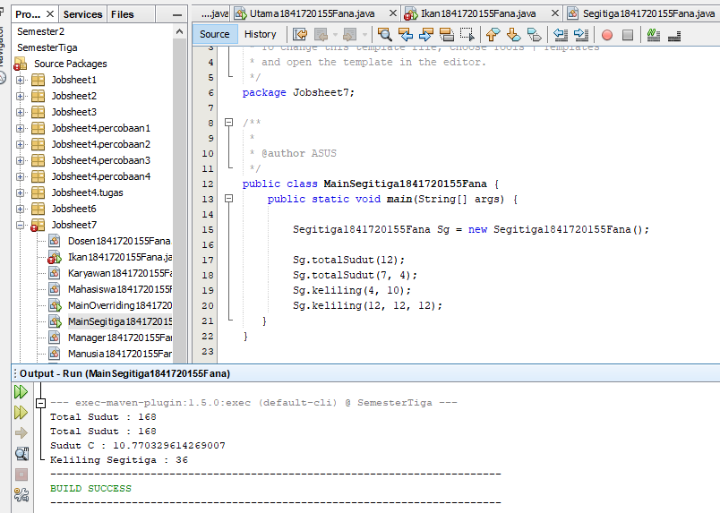

# Laporan Praktikum #7_Overriding_dan_Overloading

## Kompetensi

1. Memahami konsep Overloading dan Overriding.
2. Memahami perbedaan Overloading dan Overriding.
3. Ketetapatan dalam mengidentifikasi method overloading dan overriding
4. Mengimplementasi method overloading dan overriding. 

## Ringkasan Materi

### Pendahuluan
Overloading 

adalah kembali method nama yang sama pada suatu class. Tujuannya dapat memudahkan penggunaan atau pemanggilan methed dengan fungsionalitas yang mirip.
Untuk aturan pendeklarasian method Overloading sebagai berikut:

> Nama method harus sama. 
> Daftar parameter harus berbeda. 
> Return type boleh sama, juga boleh berbeda. 

Ada beberapa daftar parameter pada overloading dapat dilihat sebagai berikut: 

> Perbedaan daftar parameter bukan hanya terjadi pada perbedaan banyaknya parameter, tetapi juga urutan darai parameter tersebut. 
> Misalnya saja dua buah parameter berikut ini: o Function_member (int x, string n) o Function_member (String n, int x) 
> Dua parameter tersebut juga di anggap berbeda daftar parameternya. 
> Daftar parameter tidak terkait dengan penamaan variabel yang ada dalam parameter. 
> Misalnya saja 2 daftar parameter berikut : 
    o function_member(int x) 
    o function_member(int y)
> Dua daftar parameter diatas dianggap sama karena yang berbeda hanya penamaan variable parameternya saja. 

Overloading juga bisa terjadi antara parent class dengan subclass-nya jika memenuhi ketiga syarat overload. Ada beberapa aturan overloading yaitu: 

> Primitive widening conversion didahulukan dalam overloading dibandingkan boxing dan var args.  
> Kita tidak dapat melakukan proses widening dari tipe wrapper ke tipe wrapper lainnya (mengubah Integer ke Long). 
> Kita tidak dapat melakukan proses widening dilanjutkan boxing (dari int menjadi Long) 
> Kita dapat melakukan boxing dilanjutkan dengan widening (int dapat menjadi Object melalui Integer) 
> Kita dapat menggabungkan var args dengan salah satu yaitu widening atau boxing 

Overriding  

adalah Sublass yang berusaha memodifkasi tingkah laku yang diwarisi dari superclass. Tujuannya subclass dapat memiliki tingkah laku yang lebih spesifik sehingga dapat dilakukan dengan cara mendeklarasikan kembali method milik parent class di subclass. Deklarasi method pada subclass harus sama dengan yang terdapat di super class.
Kesamaan pada: 

> Nama 
> Return type (untuk return type : class A atau merupakan subclass dari class A) 
> Daftar parameter (jumlah, tipe dan urutan) 

Sehingga method pada parent class disebut overridden method dan method pada subclass disebut overriding method. Ada beberapa aturan method didalam overriding: 

> Mode akses overriding method harus sama atau lebih luas dari pada overridden method. 
> Subclass hanya boleh meng-override method superclass satu kali saja, tidak boleh ada lebih dari satu method pada kelas yang sama persis.
> Overriding method tidak boleh throw checked exceptions yang tidak dideklarasikan oleh overridden method. 

## Percobaan

### Percobaan 1 (Extends)

Untuk kasus contoh berikut terdapat tigas class, yaitu karyawan, manager, dan staff. class karyawan merupakan cuperclass dari manager dan staff dimana subclass manager dan staff memiliki method untuk menghitung gaji yang berbeda.

#### Karyawan 

[Karyawan1841720155Fana](../../src/7_Overriding_dan_Overloading/Karyawan1841720155Fana.java)

#### Staff

[Staff1841720155Fana](../../src/7_Overriding_dan_Overloading/Staff1841720155Fana.java)

#### Manager

[Manager1841720155Fana](../../src/7_Overriding_dan_Overloading/Manager1841720155Fana.java)

#### Utama dan Main Utama

[Utama1841720155Fana](../../src/7_Overriding_dan_Overloading/Utama1841720155Fana.java)

## Latihan 

link kode program : 
[PerkalianKu1841720155Fana](../../src/7_Overriding_dan_Overloading/PerkalianKu1841720155Fana.java)

4.1 Dari source coding diatas terletak dimanakah overloading ?
> jawab : 

4.2 Jika terdapat overloading ada berapa jumlah parameter yag berbeda.
> jawab : 

parameter yang berbeda berjumlah 1 yaitu pada method perkalian yang pertama berparameter(int a, int b). 
Sedangkan, method perkalian yang kedua berparameter (int a, int b, int c)

link kode program : 
[Perkalian1841720155Fana](../../src/7_Overriding_dan_Overloading/Perkalian1841720155Fana.java)

4.3 Dari source coding diatas terletak dimanakah overloading?
> jawab : 

4.4 Jika terdapat overloading ada berapa tipe parameter yang berbeda ?
> jawab : 
ada 1 parameter berbeda yang method overloading pertama menggunakan tipe parameter integer, sedangkan pada method overloading kedua menggunakan tipe parameter double, meskipun sama-sama berjumlah 2 parameter.

[Ikan1841720155Fana](../../src/7_Overriding_dan_Overloading/Ikan1841720155Fana.java)

4.5 Dari source coding diatas terletak dimanakah overriding ? 
> jawab : 

4.6 Jabarkan apabila sourcoding diatas jika terdapat overriding? 
> jawab : 
terdapat overriding yaitu pada method swim() di class Piranha.Disebut method overriding karena nama method 
tersebut sama dengan nama method di superclassnya namun berbeda di isi methodnya (dimodifikasi)

## Tugas

### 5.1 Overloading
Implementasikan konsep overloading pada class diagram

#### Segitiga

link kode program : 
[Segitiga1841720155Fana](../../src/7_Overriding_dan_Overloading/Segitiga1841720155Fana.java)

#### Main Segitiga
 

Link kode Program:
[MainSegetiga1841720155Fana](../../src/7_Overriding_dan_Overloading/MainSegitiga1841720155Fana.java)

### Overriding
Implementasikan class diagram dibawah ini dengan menggunakan teknik dynamic method dispatch : 
 
 #### Manusia

link kode program : 
[Manusia1841720155Fana](../../src/7_Overriding_dan_Overloading/Manusia1841720155Fana.java)

#### Dosen

link kode program : 
[Manusia1841720155Fana](../../src/7_Overriding_dan_Overloading/Manusia1841720155Fana.java)

#### Mahasiswa

link kode program : 
[Mahasiswa1841720155Fana](../../src/7_Overriding_dan_Overloading/Mahasiswa1841720155Fana.java)

#### Main Overriding

link kode program : 
[MainOverriding1841720155Fana](../../src/7_Overriding_dan_Overloading/MainOverriding1841720155Fana.java)

## Kesimpulan

dalam pratikum ini kita dapat mengetahui mengenal dan memahami konsep, oerbedaan , mengidentifikasi dan mengimplementasikan method overloading dan overriding..

## Pernyataan Diri

Saya menyatakan isi tugas, kode program, dan laporan praktikum ini dibuat oleh saya sendiri. Saya tidak melakukan plagiasi, kecurangan, menyalin/menggandakan milik orang lain.

Jika saya melakukan plagiasi, kecurangan, atau melanggar hak kekayaan intelektual, saya siap untuk mendapat sanksi atau hukuman sesuai peraturan perundang-undangan yang berlaku.

Ttd,

***(Fana Asy-syifa)***

