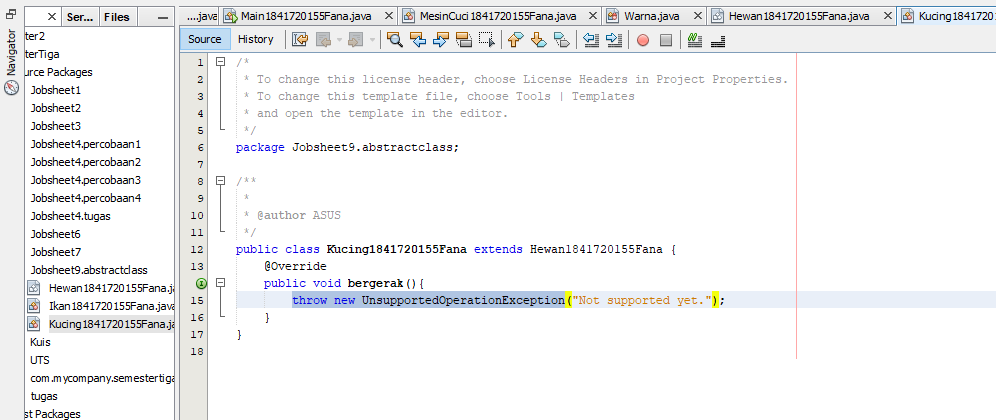
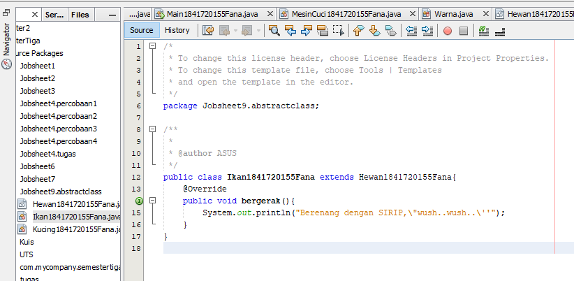
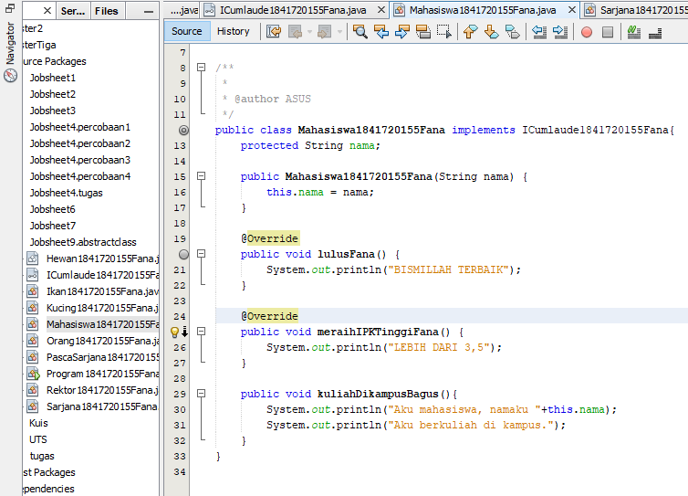

# Laporan Praktikum #9_Abstract_Class_dan_Interface

## Kompetensi

Setelah menyelesaikan lembar kerja ini mahasiswa diharapkan mampu: 
1. Menjelaskan maksud dan tujuan penggunaan Abstract Class; 
2. Menjelaskan maksud dan tujuan penggunaan Interface; 
3. Menerapkan Abstract Class dan Interface di dalam pembuatan program. 

## Ringkasan Materi

### Pendahuluan

## Percobaan

### Percobaan 1  Abstract Class 

#### Hewan 

[Hewan1841720155Fana](../../src/9_Abstract_Class_dan_Interface/Hewan1841720155Fana.java)

#### Kucing

[Kucing1841720155Fana](../../src/9_Abstract_Class_dan_Interface/Kucing1841720155Fana.java)

#### Ikan

[Ikan1841720155Fana](../../src/9_Abstract_Class_dan_Interface/Ikan1841720155Fana.java)

#### Ikan

[Orang1841720155Fana](../../src/9_Abstract_Class_dan_Interface/Orang1841720155Fana.java)

#### Program main

[Program1841720155Fana](../../src/9_Abstract_Class_dan_Interface/Program1841720155Fana.java)

#### Pertanyaan

Bolehkah apabila sebuah class yang meng-extend suatu abstract class tidak mengimplementasikan method abstract yang ada di class induknya? Buktikan!
jawab :
Tidak 

### Percobaan 2 Interface 

#### ICumlaude 

[ICumlaude1841720155Fana](../../src/9_Abstract_Class_dan_Interface/Icumlaude1841720155Fana.java)

#### Mahasiswa

[Mahasiswa1841720155Fana](../../src/9_Abstract_Class_dan_Interface/Mahasiswa1841720155Fana.java)

#### Sarjana

[Sarjana1841720155Fana](../../src/9_Abstract_Class_dan_Interface/Sarjana1841720155Fana.java)

#### Pascasarjana

[PascaSarjana1841720155Fana](../../src/9_Abstract_Class_dan_Interface/PascaSarjana1841720155Fana.java)

#### Rektor

[Rektor1841720155Fana](../../src/9_Abstract_Class_dan_Interface/Rektor1841720155Fana.java)

#### Program main

[Program2_1841720155Fana](../../src/9_Abstract_Class_dan_Interface/Program2_1841720155Fana.java)

#### Pertanyaan

a. Mengapa pada langkah nomor 9 terjadi error? Jelaskan!

jawab:

Karena dari class Mahasiswa tidak mengimplementasikan interface ICumlaude

b. Dapatkah method kuliahDiKampus() dipanggil dari objek sarjanaCumlaude di class Program? Mengapa demikian?  

jawab :

Bisa, karena class Sarjana adalah child dari class Mahasiswa

c. Dapatkah method kuliahDiKampus() dipanggil dari parameter mahasiswa di method beriSertifikatCumlaude() pada class Rektor? Mengapa demikian? 

jawab :

Tidak, karena tidak ada abstract method pada interface ICumaloud

d. Modifikasilah method beriSertifikatCumlaude() pada class Rektor agar hasil eksekusi class Program menjadi seperti berikut ini: 

jawab :

[Program2_1841720155Fana](../../src/9_Abstract_Class_dan_Interface/Program2_1841720155Fana.java)

## Kesimpulan

dalam pratikum ini kita dapat mengetahui mengenal dan memahami konsep, oerbedaan , mengidentifikasi dan mengimplementasikan method overloading dan overriding..

## Pernyataan Diri

Saya menyatakan isi tugas, kode program, dan laporan praktikum ini dibuat oleh saya sendiri. Saya tidak melakukan plagiasi, kecurangan, menyalin/menggandakan milik orang lain.

Jika saya melakukan plagiasi, kecurangan, atau melanggar hak kekayaan intelektual, saya siap untuk mendapat sanksi atau hukuman sesuai peraturan perundang-undangan yang berlaku.

Ttd,

***(Fana Asy-syifa)***

